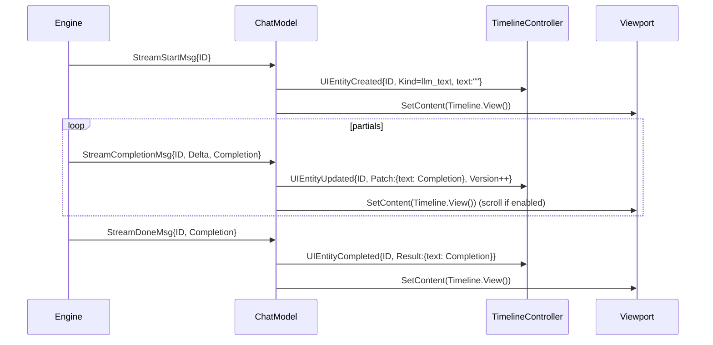
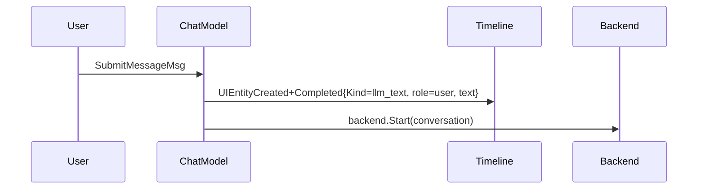
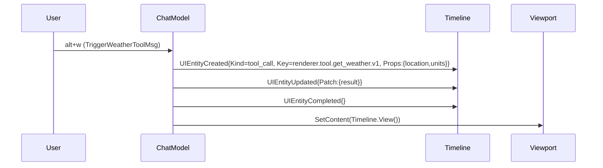

## Overview

This document summarizes the refactor of the Bobatea chat UI to render via a Turn-centric Timeline entity framework. It details the current state, changes made across files, how streaming and tool flows map to UI entities, logging, and how to continue the work.

Goals achieved:
- Integrated `pkg/timeline` (controller, registry, cache) into the chat UI in `pkg/chat/model.go`, replacing the prior conversation-rendered viewport with entity-based rendering.
- Added ready-made renderers (boxed chat messages; tool panels) and a registry hook so the app can register custom renderers at startup.
- Introduced keyboard/demo paths for tool calls; recognized slash-commands in the fake backend.
- Consolidated logging using `log.With()` for high-signal, low-noise traces.

## Key components and files

- Timeline core:
  - `bobatea/pkg/timeline/types.go`: Entity ID and lifecycle types (`UIEntityCreated/Updated/Completed/Deleted`)
  - `bobatea/pkg/timeline/registry.go`: Renderer registry
  - `bobatea/pkg/timeline/store.go`: Append-only entity store
  - `bobatea/pkg/timeline/cache.go`: Per-entity render cache
  - `bobatea/pkg/timeline/controller.go`: Applies lifecycle messages, renders via registry, size/theme hooks
  - `bobatea/pkg/timeline/renderers.go`: `LLMTextRenderer`, `ToolCallsPanelRenderer`; integrates `chatstyle`
  - `bobatea/pkg/timeline/chatstyle/{style.go,renderer.go}`: boxed lipgloss styles, `RenderBox`

- Chat integration:
  - `bobatea/pkg/chat/model.go`: Main refactor
    - New fields: `timelineReg *timeline.Registry`, `timelineCtrl *timeline.Controller`, `entityVers map[string]int64`
    - `InitialModel(...)`: creates registry/controller, registers renderers via hook, seeds existing conversation messages as timeline entities
    - `Init()`: sets viewport content to `timelineCtrl.View()`
    - `Update(...)`:
      - `tea.WindowSizeMsg`: `timelineCtrl.SetSize(...)`; re-render via `timelineCtrl.View()`
      - Streaming messages (`StreamStartMsg`, `StreamCompletionMsg`, `StreamDoneMsg`, `StreamCompletionError`) translate to entity lifecycle:
        - Start → `UIEntityCreated{Kind: llm_text}` with empty text
        - Partial → `UIEntityUpdated{Patch: {text: completion}}` with version bump tracked in `entityVers`
        - Done/Error → `UIEntityCompleted{Result: {text: final/error}}`
      - `refreshMessageMsg` and scroll-to-bottom paths now set viewport from `timelineCtrl.View()`
    - `View()`: composes header + viewport + textarea + help; viewport content comes from timeline
    - `recomputeSize()`: sets viewport dims and re-renders via `timelineCtrl.View()`
    - `submit()`: logs via `logger := log.With()...`; appends user message to conversation and emits a user entity (boxed `llm_text`)
  - `bobatea/pkg/chat/keymap.go`: added demo keybindings (alt+w, alt+s) to trigger tool entities from UI
  - `bobatea/pkg/chat/user_messages.go`: added `TriggerWeatherToolMsg`, `TriggerWebSearchToolMsg`

- Demo app wiring:
  - `bobatea/cmd/chat/main.go`:
    - New `runChatWithOptions(..., tlHook func(*timeline.Registry))` to register custom renderers at startup
    - Registers `ToolWeatherRenderer` and `ToolWebSearchRenderer` (now in cmd) for the fake/http modes
  - `bobatea/cmd/chat/tool_renderers.go`: demo tool renderers (weather, web_search)
  - `bobatea/cmd/chat/fake-backend.go`: detects `/weather` and `/search` slash-commands in user input and promptly finishes with a confirmation `StreamDoneMsg`

## Rendering flows

### Assistant streaming (engine events → stream msgs → entities)



Where to look:
- `bobatea/pkg/chat/model.go` Update(): stream switch (translation), and the scroll-to-bottom viewport refresh
- Versioning: `entityVers[id]++` tracks Updated versions

### User submission (user → timeline entity → backend)



Where to look:
- `model.go::submit()` logs via `slogger := log.With()...`; appends to conversation and emits user entity; then `startBackend()`

### Tool triggers (keyboard) and slash commands

Keyboard (alt+w / alt+s):



Slash commands `/weather Paris` and `/search golang` handled by fake-backend:
- `cmd/chat/fake-backend.go`: If input starts with `/weather` or `/search`, send `StreamDoneMsg` with a short assistant confirmation (ensures we see streaming path working end-to-end). Tool entities are still created via keyboard triggers; a future step can map backend tool events into entities too.

## Logging

- Unified request-scope logs using `logger := log.With().Int64("update_call_id", ...).Logger()` in `Update()` and `submit()`
- View-scope logs via `vlogger := log.With().Int64("view_call_id", ...).Logger()` in `View()`
- Look for:
  - “UPDATE ENTRY” / “VIEW ENTRY”
  - Stream translations: “StreamStartMsg details”, “StreamCompletionMsg details”, “stream_message_total”
  - Submit: “SUBMIT ENTRY”, “User message appended, calling startBackend()”
  - Tool triggers: “Handling /weather command (backend) …” in submit, or “renderer.tool…rendered” entries
  - Files: `/tmp/fake-chat.log` (cmd/chat/main.go sets zerolog console)

## Behavior expectations

- Immediate header; textarea and help at bottom; timeline content in the viewport
- Submitting user text emits a boxed `(user)` message and starts backend streaming
- Streaming produces an `(assistant)` boxed message that is updated incrementally
- Keyboard alt+w / alt+s produce tool_call entities using demo renderers
- Slash-commands `/weather` and `/search` return a short assistant confirmation (via fake-backend)

## Important functions to review

- Chat model wiring
  - `InitialModel(...)` in `pkg/chat/model.go`: registry/controller creation & seeding
  - `Init()`: viewport content from timeline
  - `Update(...)`: stream translations; WindowSize handling; refresh path; key handling for alt+w/alt+s
  - `recomputeSize()`: timeline `View()` integration
  - `View()`: vlogger usage and switched content path
  - `submit()`: unified logging, conversation append, user entity creation, backend start

- Renderers
  - `pkg/timeline/renderers.go`: `LLMTextRenderer` using `chatstyle` boxed output; `ToolCallsPanelRenderer`
  - `pkg/timeline/chatstyle`: `DefaultStyles`, `RenderBox`
  - `cmd/chat/tool_renderers.go`: `ToolWeatherRenderer`, `ToolWebSearchRenderer` registered via `runChatWithOptions` hook

- Demo backend
  - `cmd/chat/fake-backend.go`: detects `/weather` and `/search` and emits a final text confirmation; normal inputs stream reversed words

## How to run

```bash
cd bobatea
go run ./cmd/chat chat
# Submit text, or use slash-commands like "/weather Paris"
# alt+w and alt+s to render demo tool entities
```

## Known gaps and next steps

1) Tool event mapping
   - Today: keyboard triggers create tool entities; fake-backend only confirms slash commands
   - Next: emit and translate tool_call/tool_result events (TurnStore) into `UIEntity*` automatically

2) Selection and metadata
   - Expose per-entity selection in `timeline.Controller` and integrate with chat keymap
   - Extend `LLMTextRenderer` with `metadata` (usage, engine, stop reason) line similar to `conversation/model.go`

3) TurnStore translation & pub/sub
   - Introduce an event bus feed for UI entities, sourced from provider/middleware events
   - Replace direct stream→UI translation with TurnStore-powered dispatcher for consistency

4) Cleanup
   - Remove reliance on `conversationui.Model` where still present (selection, clipboard helpers) or adapt to entity model

5) Testing & perf
   - Table tests for stream→entity mapping
   - Benchmark render cache (hits/misses) and debounce frequent partials if needed


