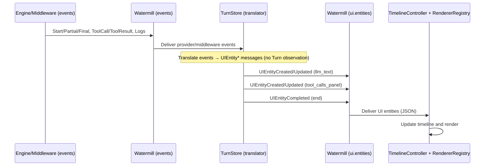
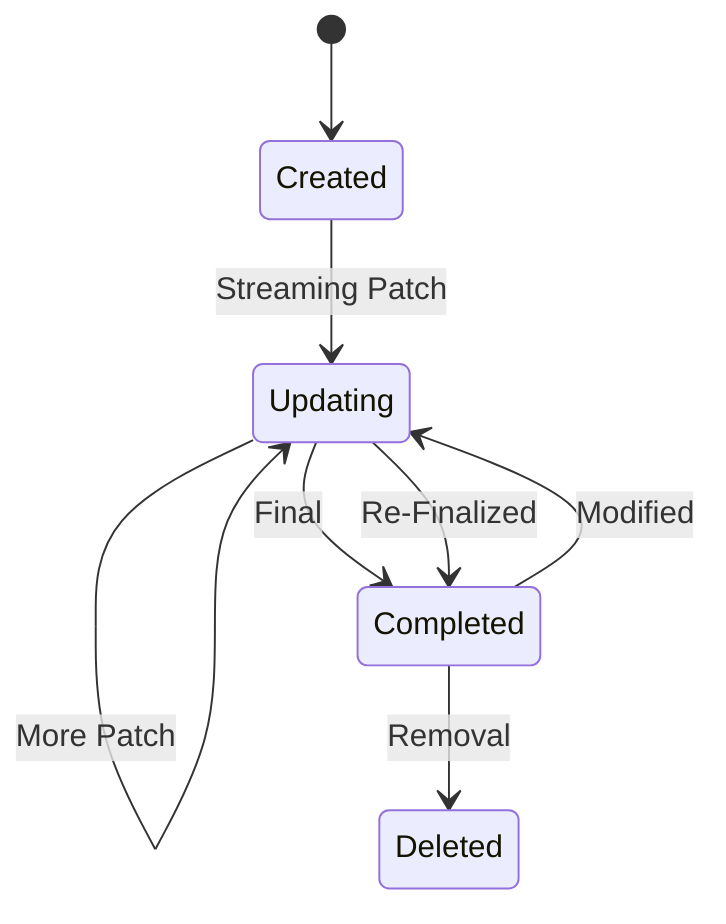

## Design: Decoupled UI Messaging for Turn-Centric Visualization and Timeline

Date: 2025-08-11

### Motivation

With the Turn/Block architecture, engines and middleware now produce structured outputs (text, tool_call, tool_use, system, other) and multiple asynchronous streams per Turn. The current UI message protocol forwards text-centric events directly to append/update a single assistant message. This loses structure (block IDs, kinds), constrains visualization to markdown text, and tangles timeline rendering with provider streaming.

This document proposes a new UI messaging design that:
- Decouples UI messages from provider streaming and even from conversation messages.
- Represents lifecycle of renderable “entities” (created/updated/completed/deleted).
- Registers how each entity can be rendered via a renderer registry and props.
- Supports richer widgets (diffs, multi-tool panels, interactive views) and cache-aware updates.

### Design goals

- Entity lifecycle events: created → updated (streaming) → completed; optional modified/deleted.
- Uniform identity model: stable IDs correlate entities, Turns and Blocks.
- Renderer registry: map entity kind/subtype to UI component that renders it; props and capabilities defined per renderer.
- Cache-awareness: entities specify effective cache keys (width/theme/props hash); UI can mark dirty or request re-render.
- Interaction-friendly: UI can send selection and action events back; entities can respond or mark themselves modified.
- Timeline decoupling: a separate controller composes a timeline view from entities, independent of underlying Turn storage.

### Conceptual model

- Entity: A renderable unit in the UI. Examples: LLMText, ToolCallsPanel, ToolResult, DiffView, MetadataPanel.
- Identity: `EntityID { RunID, TurnID, BlockID?, LocalID, Kind }`
  - `RunID`/`TurnID`: correlation scope
  - `BlockID`: optional, when derived from a specific block
  - `LocalID`: unique within the Turn for multi-entity cases (e.g., multiple widgets for one Turn)
  - `Kind`: semantic kind for renderer lookup (e.g., `llm_text`, `tool_calls_panel`, `diff_view`)

### Event types (UI channel)

Minimal, provider-agnostic UI event protocol carried over the router (e.g., Watermill topic `ui.entities`):

```go
// Sent by backend → UI
type UIEntityCreated struct {
    ID         EntityID            `json:"id"`
    Renderer   RendererDescriptor  `json:"renderer"` // how to render, capabilities
    Props      map[string]any      `json:"props"`    // initial props (may be partial)
    StartedAt  time.Time           `json:"started_at"` // creation/start timestamp
    Labels     map[string]string   `json:"labels,omitempty"` // tags for grouping/filtering
}

type UIEntityUpdated struct {
    ID        EntityID            `json:"id"`
    Patch     map[string]any      `json:"patch"`      // partial props update (streaming)
    Version   int64               `json:"version"`    // monotonic for conflict detection
    UpdatedAt time.Time           `json:"updated_at"` // last update timestamp
}

type UIEntityCompleted struct {
    ID      EntityID             `json:"id"`
    Result  map[string]any       `json:"result,omitempty"` // final state snapshot
}

type UIEntityDeleted struct {
    ID EntityID `json:"id"`
}

```

Renderer descriptor (declares UI-side component and caching):

```go
type RendererDescriptor struct {
    Key          string            `json:"key"`          // e.g., "renderer.llm_text.markdown.v1"
    Kind         string            `json:"kind"`         // e.g., "llm_text", "tool_calls_panel"
}
```

Props content is renderer-defined. Example for `llm_text`:

```json
{
  "text": "partial or final text",
  "markdown": true,
  "metadata": { "engine": "gpt-4o", "usage": {"in": 123, "out": 456} }
}
```

### Event translation to Entities (via TurnStore)

- Engines and middlewares emit provider-agnostic events (see Turns and Middleware docs).
- The `TurnStore` subscribes to those events (e.g., Watermill), and TRANSLATES them into UI entity lifecycle messages without inspecting Turn state.
- Translation rules (high-level):
  - LLM text stream: on start → `UIEntityCreated{Kind=llm_text}`; on partial → `UIEntityUpdated{Patch.text}`; on final → `UIEntityCompleted`.
  - Tool orchestration: aggregate multiple `tool_call`/`tool_result` provider/middleware events into a single `tool_calls_panel` entity via `UIEntityUpdated` patches.
  - Structured outputs: when middleware emits domain events (diffs, citations), create specialized entities like `diff_view`, `citations_panel`.
  - Metadata: usage/stop reason/logs are attached to a `metadata_panel` entity via updates.

Ordering:
- Append-only: the timeline appends entities in the order `UIEntityCreated` messages arrive on `ui.entities`.
- If multiple sources/shards are merged, use `StartedAt` as a deterministic tiebreaker when arrival order is ambiguous.

### Timeline decoupling

- The UI maintains a `TimelineController` that composes the visible list from received entity events.
- The controller is unaware of provider or Turn internals; it only:
  - Tracks entity lifecycles
  - Resolves `RendererDescriptor` to a concrete renderer
  - Computes cache keys from `CacheKeys` and a presentation context `{width, theme}`
  - Updates viewport content incrementally when entities change or when the selection/focus changes

This separation enables multiple parallel async streams (text, tools, logs) under one Turn without conflating them into a single assistant message.

### Caching and invalidation

- Cache key: `hash(Renderer.Key, width, theme, hash(PropsRelevantSubset))`
- UI applies `Dirty` hints from `UIEntityUpdated` to invalidate selectively.
- On resize/theme change, the controller invalidates only entities whose `CacheKeys` intersect the changed context keys.

### Example flows

1) Pure text completion (translated by TurnStore)
   - On provider `Start`: emit `UIEntityCreated{Kind=llm_text, ID={..., LocalID:"text-1"}, Props={text:"", markdown:true}}`
   - On provider `Partial`: emit `UIEntityUpdated{ID.text-1, Patch={text:"...partial..."}}`
   - On provider `Final`: emit `UIEntityCompleted{ID.text-1, Result={text:"...final..."}}`

2) Multiple tool calls aggregated into one panel
   - On first tool_call event: `UIEntityCreated{Kind=tool_calls_panel, ID.LocalID:"tools-1", Props={calls:[]}}`
   - On subsequent tool_call events: `UIEntityUpdated{ID.tools-1, Patch={calls:[{id,name,args,status:"pending"}]}}`
   - On tool_result events: `UIEntityUpdated{ID.tools-1, Patch={calls:[{id,status:"done",result} ]}}`
   - On end: optional `UIEntityCompleted{ID.tools-1}`

3) Post-turn custom entity (e.g., summary/diff)
   - After final: TurnStore inspects accumulated events or middleware emits a `summary`/`diff` event
   - Emit `UIEntityCreated{Kind=diff_view, ID.LocalID:"diff-1", Props={before:"...", after:"...", mode:"unified"}}`
   - If incremental: `UIEntityUpdated{ID.diff-1, Patch={after:"...more..."}}`
   - When stable: `UIEntityCompleted{ID.diff-1}`

### Transport and versioning

- Topic: `ui.entities` (JSON). Keep `ui` for backward-compatible text stream if desired during migration.
- Envelope includes `schema_version` for evolution.
- Correlate with existing `EventMetadata` by embedding `RunID`, `TurnID` and—when applicable—`BlockID` inside `EntityID`.

### Minimal Go types (pseudocode)

```go
type EntityID struct {
    RunID   string `json:"run_id,omitempty"`
    TurnID  string `json:"turn_id,omitempty"`
    BlockID string `json:"block_id,omitempty"`
    LocalID string `json:"local_id,omitempty"`
    Kind    string `json:"kind"`
}

type UIMessage struct {
    SchemaVersion string      `json:"schema_version"`
    OccurredAt    time.Time   `json:"occurred_at"`
    Any           interface{} `json:"any"` // one of: UIEntityCreated/Updated/Completed/Deleted
}
```

### Sequence diagram: provider/middleware events → TurnStore translation → UI timeline



### State model per entity



### Backward compatibility plan

- Phase 1: Keep existing `ui` events; add an adapter that converts them into `llm_text` entities. The old `conversationui.Model` can continue to render while the new timeline is developed in parallel.
- Phase 2: Switch engine/middleware routing to produce Turn updates and `ui.entities` messages. UI chooses new timeline path by feature flag.
- Phase 3: Remove old path once parity is achieved.

### Implementation outline

1) Define `pinocchio/pkg/ui/messages` for the new types and a helper publisher.
2) Implement `TurnToEntitiesAdapter` that observes Turn changes and emits entity events.
3) Add `RendererRegistry` and `TimelineController` in a new `bobatea/pkg/turnui` package.
4) Port markdown/width-aware caching logic to `llm_text` renderer; implement `tool_calls_panel` and `diff_view`.
5) Add UI→Backend interaction handler for selections and actions.
6) Wire Watermill topics and feature flag in the chat command (`pinocchio/pkg/cmds/cmd.go`).

### Notes and references

- Event metadata and streaming today:

```startLine:295:endLine:336:geppetto/pkg/events/chat-events.go
type EventMetadata struct {
    conversation.LLMMessageMetadata
    ID     conversation.NodeID `json:"message_id" yaml:"message_id"`
    RunID  string `json:"run_id,omitempty" yaml:"run_id,omitempty"`
    TurnID string `json:"turn_id,omitempty" yaml:"turn_id,omitempty"`
    Extra  map[string]any `json:"extra,omitempty" yaml:"extra,omitempty"`
}
```

- Current UI forwarder and message mapping (for compatibility):

```startLine:103:endLine:168:pinocchio/pkg/ui/backend.go
func StepChatForwardFunc(p *tea.Program) func(msg *message.Message) error { /* ... */ }
```


