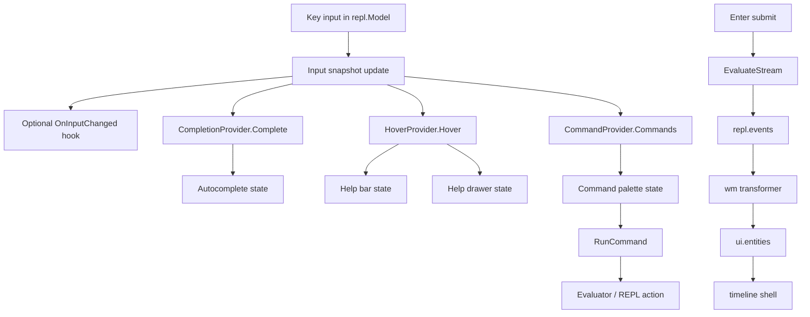

# REPL Integration Analysis

> [!NOTE]
> This document is intentionally newcomer-oriented. It starts with architecture fundamentals, then drills down into concrete implementation surfaces, tradeoffs, and a recommended plan.
> Lipgloss v2 layering implications are covered in `analysis/02-lipgloss-v2-canvas-layer-addendum.md`.

## 1) Executive Summary

`bobatea/pkg/repl` already has a solid event-driven core for **evaluation output** (input submit -> evaluator stream -> Watermill topics -> timeline entities -> viewport rendering). The missing pieces are almost entirely on the **live input side**: there is no input callback pipeline, no completion UI integration, no evaluator capability discovery for help/type metadata, and no command-palette orchestration.

The most effective path is to keep the current timeline/event architecture for transcript rendering and add a small, explicit **evaluator capability layer** for interactive input features:

- `CompletionProvider` for autocomplete candidates.
- `InputAnalyzer`/`HoverProvider` for symbol/type/signature/help signals.
- `CommandProvider` for palette/slash commands.

Then integrate these into `repl.Model` with explicit local state for:

- transient input snapshot + cursor,
- autocomplete popup visibility/selection,
- help bar model (single-line metadata),
- optional help drawer model (expanded docs/signature),
- command palette model.

This keeps the current architecture intact while adding the missing interaction loop.

## 2) Fundamentals: How the Current REPL Works

> [!TIP]
> Read this section first if you are new to the codebase. The implementation details later assume this mental model.

### 2.1 Runtime Pipeline Today

Current flow for a submitted command is:

```mermaid
flowchart LR
  A[User types in textinput] --> B[repl.Model.updateInput enter]
  B --> C[repl.Model.submit]
  C --> D[publish UI input entity to ui.entities]
  C --> E[evaluator.EvaluateStream emit(Event)]
  E --> F[publish repl.events]
  F --> G[RegisterReplToTimelineTransformer]
  G --> H[publish timeline.* envelope to ui.entities]
  H --> I[timeline.RegisterUIForwarder]
  I --> J[tea.Program.Send timeline message]
  J --> K[repl.Model receives timeline.UIEntity*]
  K --> L[timeline.Controller + Shell]
  L --> M[Viewport refresh]
```

### 2.2 Key Components and Roles

- `bobatea/pkg/repl/model.go`
- `repl.Model` owns the input widget, history, timeline shell, and event publication.
- `updateInput` handles enter/up/down/tab and calls `submit`.
- `submit` emits an input entity and runs `Evaluator.EvaluateStream`.

- `bobatea/pkg/repl/evaluator.go`
- Defines the **minimal** evaluator contract: `EvaluateStream`, prompt/name/multiline/extension.
- Defines event kinds (`EventStdout`, `EventStderr`, `EventResultMarkdown`, etc.) for timeline mapping.

- `bobatea/pkg/repl/wm_transformer.go`
- `RegisterReplToTimelineTransformer` subscribes to `repl.events` and emits `timeline.created/updated/completed` envelopes on `ui.entities`.
- Handles chunked stream updates (`append` patching) and per-turn local IDs.

- `bobatea/pkg/timeline/*`
- `timeline.Shell` + `timeline.Controller` manage selection/focus/viewport/entity model lifecycle.
- Renderer factories (`text`, `markdown`, `structured_data`, `log_event`, etc.) are registered in `NewModel`.

- `bobatea/pkg/eventbus/eventbus.go`
- Lightweight in-memory Watermill router and pub/sub topics (`repl.events`, `ui.entities`).

## 3) What Exists vs What Is Missing

### 3.1 Already Present (Useful Building Blocks)

- Standalone autocomplete widget:
- `bobatea/pkg/autocomplete/autocomplete.go`
- Has async completioner function, textinput, listbox selection, and `DoneMsg`.

- Standalone command palette widget:
- `bobatea/pkg/commandpalette/model.go`
- Has command registration, fuzzy filtering, overlay-style view, and command execution.

- Overlay utility:
- `bobatea/pkg/overlay/overlay.go`
- Utility for placing one view over another.

- Advanced JS parse/resolve/completion toolkit:
- `go-go-goja/pkg/jsparse/*`
- Provides parse analysis, scope resolution, completion context extraction, candidate resolution, and tree-sitter cursor context.

### 3.2 Missing from REPL Integration

- No callback or observer for **input changed while typing**.
- No cursor-aware input snapshot contract.
- No autocomplete integration in `repl.Model` despite existing `pkg/autocomplete`.
- No help bar/help drawer state in REPL model.
- No command palette integration in REPL model.
- No evaluator capability interface beyond `EvaluateStream`.
- No standardized command model for slash commands or palette items.

### 3.3 Shape Mismatch: Evaluator Capability vs Interface

`repl.Evaluator` is intentionally narrow. The concrete JavaScript evaluator (`bobatea/pkg/repl/evaluators/javascript/evaluator.go`) already has richer methods:

- `GetHelpText`
- `IsValidCode`
- `GetAvailableModules`
- `GetRuntime`

But these are not discoverable through `repl.Evaluator`, so REPL UI cannot use them generically.

## 4) Relevant Code Locations (Implementation Map)

### 4.1 Core REPL

- `bobatea/pkg/repl/model.go`
- `NewModel`: widget registration and shell setup.
- `Update`: root message routing.
- `updateInput`: where key routing for input mode currently lives.
- `submit`: critical integration point for evaluator execution and event publishing.

- `bobatea/pkg/repl/evaluator.go`
- Existing minimum evaluator abstraction.

- `bobatea/pkg/repl/config.go`
- Houses config knobs; includes fields currently not used by the live model (`StartMultiline`, `EnableExternalEditor`).

- `bobatea/pkg/repl/messages.go`
- Contains message structs for features not wired anymore (external editor/slash command/multiline toggles).

### 4.2 Event Translation and Timeline

- `bobatea/pkg/repl/wm_transformer.go`
- Current event-kind translation logic.

- `bobatea/pkg/timeline/shell.go`
- Viewport/selection/scroll behavior.

- `bobatea/pkg/timeline/controller.go`
- Entity lifecycle application and selected-entity message routing.

- `bobatea/pkg/timeline/registry.go`
- Factory registry for renderer models.

### 4.3 Existing Reusable Widgets

- `bobatea/pkg/autocomplete/autocomplete.go`
- Async suggestion list + selection messages.

- `bobatea/pkg/commandpalette/model.go`
- Palette visibility + filtering + command execution.

- `bobatea/pkg/listbox/listbox.go`
- Keyboard-driven list selection primitive.

- `bobatea/cmd/command-palette-demo/main.go`
- Shows concrete integration pattern for `Show()`, `IsVisible()`, and overlay drawing.

### 4.4 Evaluator-Driven Analysis Tooling (Strong Reuse Candidate)

- `go-go-goja/pkg/jsparse/analyze.go`
- `Analyze`, `CompleteAt`, diagnostics.

- `go-go-goja/pkg/jsparse/completion.go`
- `ExtractCompletionContext`, `ResolveCandidates`, builtin + lexical candidate strategies.

- `go-go-goja/pkg/jsparse/resolve.go`
- Binding and scope resolution (`BindingForNode`, `IsDeclaration`, `IsReference`, `IsUnresolved`).

- `go-go-goja/pkg/jsparse/treesitter.go`
- Cursor-to-node mapping for incomplete code (`NodeAtPosition`, `HasError`).

## 5) Experiment Findings (Ticket Scripts)

The following scripts were created and run in this ticket:

- `ttmp/2026/02/13/BOBA-001-IMPROVE-REPL-ANALYSIS--improve-repl-analysis/scripts/probe_jsparse_completion.go`
- `ttmp/2026/02/13/BOBA-001-IMPROVE-REPL-ANALYSIS--improve-repl-analysis/scripts/probe_repl_evaluator_capabilities.go`

### 5.1 Completion Works Even with Incomplete Input

From `probe_jsparse_completion.go`:

- For `obj.|` with parse error (`Unexpected end of input`), completion context is still `property` and candidates are produced.
- For `obj.al|`, filtering narrows correctly to `alpha`.
- For `console.|`, method candidates are returned.

Implication:

- Tree-sitter + jsparse context extraction is well suited for REPL typing states where the parser is temporarily invalid.

### 5.2 Capability Mismatch is Real but Bridgeable

From `probe_repl_evaluator_capabilities.go`:

- `repl.Evaluator` surface: only 5 methods.
- `javascript.Evaluator` surface: richer (help text, validation, modules, runtime access).
- Optional interface assertions succeed when checking concrete type via the `repl.Evaluator` value.

Implication:

- We can extend behavior safely with optional capability interfaces without breaking existing evaluators.

## 6) Design Options

### Option A: Minimal Optional Interfaces in `pkg/repl` (Recommended)

Add optional interfaces (no breaking change):

```go
// pkg/repl/capabilities.go

type InputSnapshot struct {
  Text      string
  CursorCol int
  CursorRow int
  Width     int
  Height    int
  Timestamp time.Time
}

type CompletionRequest struct {
  Snapshot InputSnapshot
  Trigger  string // "manual", "dot", "typing", etc.
  Limit    int
}

type CompletionItem struct {
  Label       string
  InsertText  string
  Detail      string
  Kind        string
  Score       float64
  Documentation string
}

type CompletionProvider interface {
  Complete(ctx context.Context, req CompletionRequest) ([]CompletionItem, error)
}

type HoverRequest struct {
  Snapshot InputSnapshot
}

type HoverInfo struct {
  Symbol     string
  Type       string
  Signature  string
  Summary    string
  Markdown   string
}

type HoverProvider interface {
  Hover(ctx context.Context, req HoverRequest) (*HoverInfo, error)
}

type Command struct {
  ID          string
  Title       string
  Description string
}

type CommandProvider interface {
  Commands(ctx context.Context, snapshot InputSnapshot) ([]Command, error)
  RunCommand(ctx context.Context, id string, snapshot InputSnapshot) error
}
```

Pros:

- Very low migration risk.
- Existing evaluators remain valid.
- Enables evaluator-driven UX uniformly.

Cons:

- Requires new plumbing/state in `repl.Model`.
- Some duplication with existing `pkg/autocomplete` types unless adapter layer is added.

### Option B: Event-Bus Plugin Pipeline for Input

Emit `repl.input.changed` events on bus and let external plugins respond with suggestions/help messages.

Pros:

- Strong decoupling, easy external module integration.

Cons:

- Asynchronous correlation complexity (request IDs, staleness, ordering).
- Harder local reasoning for UI latency-sensitive interactions.

### Option C: Full Widget Host Abstraction in REPL

Create plugin slots and a panel manager for drawers/bars/overlays with a generalized registry.

Pros:

- Very extensible long-term.

Cons:

- Overkill for immediate goals.
- Large refactor surface and coordination risk.

## 7) Recommended Architecture

Choose **Option A now**, with one small event hook for external consumers.

### 7.1 Core Principle

Keep evaluation transcript on existing timeline/event pipeline. Add a **live-input interaction lane** local to `repl.Model`, driven by optional evaluator capabilities.

### 7.2 Proposed High-Level Diagram



### 7.3 Model State Additions

In `repl.Model`, add fields for transient UX:

- `inputSnapshot InputSnapshot`
- `completionItems []CompletionItem`
- `completionVisible bool`
- `completionIndex int`
- `completionReqID int64` / `completionActiveReq int64`
- `helpBar *HoverInfo`
- `helpDrawer *HoverInfo`
- `helpDrawerOpen bool`
- `commandPalette commandpalette.Model`
- `paletteVisible bool`

### 7.4 Input Routing Strategy

Current `updateInput` directly maps keys to history/submit/focus. Proposed routing order:

1. If palette visible -> route keys to palette.
2. Else if completion popup visible and key in navigation set -> handle completion.
3. Else if help drawer focused -> route drawer keys.
4. Else default input behavior (existing history + submit) and trigger callbacks/capabilities on text changes.

Pseudo flow:

```go
func (m *Model) updateInput(k tea.KeyMsg) (tea.Model, tea.Cmd) {
  if m.paletteVisible {
    return m.updatePalette(k)
  }
  if m.completionVisible && isCompletionNavKey(k) {
    return m.updateCompletionNav(k)
  }
  if m.helpDrawerOpen && m.helpDrawerFocused {
    return m.updateHelpDrawer(k)
  }

  before := m.textInput.Value()
  m.textInput, cmd := m.textInput.Update(k)
  after := m.textInput.Value()

  if before != after || cursorMoved(k) {
    snap := m.captureSnapshot()
    return m, tea.Batch(
      cmd,
      m.scheduleInputCallbacks(snap),
      m.scheduleCompletion(snap, triggerFromKey(k)),
      m.scheduleHover(snap),
      m.scheduleCommandRefresh(snap),
    )
  }

  // handle submit/history as today
}
```

## 8) Feature-by-Feature Integration Plan

### 8.1 Autocomplete

#### Desired Behavior

- Trigger on `.` and optionally after identifier typing with debounce.
- Show popup near input line.
- Accept on `tab` or `enter`.
- Cancel on `esc`.

#### Integration Points

- `repl.Model.updateInput` for trigger detection.
- `pkg/autocomplete` can be used as internal popup model, or REPL can implement a lighter inline popup using `pkg/listbox`.

#### Important Refactors

- Add correlation/request IDs to prevent stale async updates from older queries.
- Normalize to evaluator `CompletionItem` and map to popup item struct.
- Deduplicate candidates (experiment showed duplicates like `localName` from two sources).

#### Pseudocode

```go
func (m *Model) scheduleCompletion(s InputSnapshot, trigger string) tea.Cmd {
  p, ok := m.evaluator.(CompletionProvider)
  if !ok {
    return nil
  }
  reqID := m.nextCompletionReqID()
  return func() tea.Msg {
    items, err := p.Complete(context.Background(), CompletionRequest{Snapshot: s, Trigger: trigger, Limit: 50})
    return CompletionResultMsg{ReqID: reqID, Items: dedupe(items), Err: err}
  }
}

func (m *Model) onCompletionResult(msg CompletionResultMsg) {
  if msg.ReqID < m.latestCompletionReqID {
    return // stale
  }
  m.completionItems = msg.Items
  m.completionVisible = len(msg.Items) > 0
}
```

### 8.2 Input Callbacks for External Modules

#### Desired Behavior

- External module receives frequent snapshots while user types.
- Can return semantic hints, diagnostics, syntax tokens, or open-file preview instructions.

#### Design Recommendation

Keep simple callback interface in REPL first:

```go
type InputObserver interface {
  OnInputChanged(ctx context.Context, s InputSnapshot) error
}
```

Then optionally mirror it onto Watermill for decoupled listeners:

- publish `repl.input.changed` topic with request ID.
- consume plugin responses on `repl.input.feedback` topic.

#### Why This Shape

- Starts easy, preserves low latency.
- Event bus extension can be added for external process/plugin cases.

### 8.3 Help Drawer

#### Desired Behavior

- Expanded panel showing function docs/signature/examples for current symbol.
- Toggle open/closed (for example `ctrl+h` or from palette command).

#### Integration Options

- Inline bottom panel inside `repl.Model.View` (fastest).
- Reuse timeline renderer stack by creating a synthetic help entity (possible but heavier for transient state).

#### Recommendation

Use local bottom panel in REPL first. Render markdown content from `HoverInfo.Markdown`. For richer editor behavior later, borrow the drawer patterns from `go-go-goja/cmd/inspector/app/drawer.go`.

### 8.4 Help Bar

#### Desired Behavior

- One-line dynamic hint (symbol type/signature/status), replacing static help text.

#### Recommendation

Replace current static footer with:

- left: key hints,
- right: current hover/type summary.

Fallback logic:

- if no hover info -> existing static help text.

### 8.5 Command Palette (Open with `/`)

#### Existing Primitive

`pkg/commandpalette` already provides command registration + fuzzy filtering + execution.

#### Key UX Decision

Slash has semantic conflicts in REPLs (`/` as division, regex literal starts, literal path segments).

Use policy:

- `/` opens palette only when input is empty and cursor at position 0.
- If input not empty, `/` inserts normally.
- Keep `ctrl+p` as explicit universal open key.

#### Palette/Evaluator Bridge

Expose evaluator commands via optional `CommandProvider`.
Also include built-ins:

- toggle help drawer,
- clear history,
- clear timeline selection,
- show evaluator help,
- switch mode.

## 9) Gaps and Technical Debt Worth Addressing During Integration

### 9.1 Documentation Drift

`bobatea/docs/repl.md` documents APIs/features that no longer exist in the current REPL implementation (`SetTheme`, `AddCustomCommand`, slash command behavior). This should be corrected to avoid onboarding confusion.

### 9.2 Dormant Config/Message Fields

`StartMultiline`, `EnableExternalEditor`, and several message types remain but are not actively wired in model behavior.

Decision needed:

- either fully implement these in the new architecture,
- or deprecate/remove to reduce ambiguity.

### 9.3 Completion Result Quality

Experiment surfaced candidate duplication from mixed scopes/sources. Need candidate normalization:

- dedupe by `(label, kind)`,
- sort by score and source quality,
- avoid drawer-local duplicates of top-level symbols.

## 10) Suggested Implementation Sequence

### Phase 1: Capability Interfaces and Snapshot Plumbing

- Add optional capability interfaces in `pkg/repl`.
- Add input snapshot capture and change detection in `updateInput`.
- Add dynamic help bar state and render path.

### Phase 2: Autocomplete MVP

- Implement completion request/response messages with stale request guarding.
- Integrate popup rendering in REPL view.
- Wire keyboard navigation and accept/cancel behavior.

### Phase 3: Help Drawer MVP

- Add drawer state and toggles.
- Populate from `HoverProvider` markdown/signature info.

### Phase 4: Command Palette Integration

- Embed `commandpalette.Model` in REPL.
- Implement trigger policy (`ctrl+p`, `/` at empty prompt).
- Register evaluator and built-in commands.

### Phase 5: External Callback and Optional Event-Bus Hook

- Add `InputObserver` callback support.
- Optional: publish/subscribe feedback topics for out-of-process integrations.

### Phase 6: Docs and Tests

- Update `docs/repl.md` to match current + new APIs.
- Add tests for completion staleness, slash trigger policy, and help bar/drawer update semantics.

## 11) Testing Strategy

### 11.1 Unit Tests

- `repl` input update:
- completion request generation and stale result dropping.
- slash trigger behavior based on cursor/input state.
- help bar fallback to static text.

- capability assertions:
- evaluator implementing optional interfaces is discovered and used.
- evaluator without capabilities degrades gracefully.

### 11.2 Integration Tests

- REPL + JS evaluator + jsparse completion path.
- Timeline output still works while autocomplete/help/palette are active.

### 11.3 Manual TUI Validation

- Open REPL with JS evaluator.
- Type `obj.` and verify completion popup.
- Navigate candidates and insert.
- Verify help bar updates while moving cursor.
- Toggle help drawer and confirm docs/signatures.
- Open palette via `ctrl+p` and via `/` on empty line.
- Confirm `/` in non-empty expression inserts slash literally.

## 12) Open Questions

- Should completions/hovers be strictly evaluator-provided, or should REPL own fallback providers for known evaluators (JS)?
- Do we want palette command execution to be synchronous in REPL update loop or async command-based only?
- Is help drawer transient (ephemeral UI) or should it optionally produce timeline entities (for history/audit)?
- Should external input callbacks be best-effort fire-and-forget, or should they be allowed to block UI updates with deadlines?

## 13) Final Recommendation

Implement evaluator capability interfaces and local REPL interaction state now (Option A), then optionally add event-bus plugin hooks once interaction semantics are stable.

This gives the requested features with minimal architectural risk, preserves the proven timeline-centric output path, and allows incremental rollout per feature:

1. help bar,
2. autocomplete,
3. help drawer,
4. command palette,
5. external callback bridge.

> [!WARNING]
> Do not implement these features by overloading the existing `Event` transcript stream. Transcript events are output/history oriented; live input interactions need a separate, low-latency control lane.

## 14) Concrete Change Matrix (Files, Symbols, Responsibility)

This section maps each requested feature to exact implementation touch points.

### 14.1 Autocomplete

Primary files:

- `bobatea/pkg/repl/model.go`
- `bobatea/pkg/repl/config.go`
- `bobatea/pkg/repl/messages.go`
- `bobatea/pkg/autocomplete/autocomplete.go` (adapter or embedded model)

Likely additions:

- `repl.Model` fields:
- completion visibility/index/items/request IDs.
- optional embedded `autocomplete.Model`.

- New messages:
- `CompletionResultMsg`
- `CompletionErrMsg`
- `CompletionAcceptedMsg` (if not using `autocomplete.DoneMsg` directly)

- Config:
- `EnableAutocomplete bool`
- `AutocompleteTriggerOnDot bool`
- `AutocompleteDebounce time.Duration`

Refactor notes:

- `updateInput` needs one pass of key arbitration before default textinput update.
- completion insertion should preserve cursor position for partial replacements.
- if using `pkg/autocomplete`, adapt between `CompletionItem` and `autocomplete.Suggestion`.

### 14.2 Input Callbacks / External Hooks

Primary files:

- `bobatea/pkg/repl/model.go`
- `bobatea/pkg/repl/evaluator.go` or new `bobatea/pkg/repl/capabilities.go`
- optional: `bobatea/pkg/eventbus/eventbus.go` topic extension

Likely additions:

- `InputSnapshot` struct.
- `InputObserver` interface and registration in `Config` or model constructor.
- optional event topic constants:
- `TopicReplInputChanged`
- `TopicReplInputFeedback`

Refactor notes:

- callback latency needs timeout and cancellation strategy.
- one slow observer must not freeze keypress responsiveness.
- if responses are async, sequence numbers are required to prevent stale UI application.

### 14.3 Help Drawer

Primary files:

- `bobatea/pkg/repl/model.go`
- `bobatea/pkg/repl/styles.go`
- optional new file: `bobatea/pkg/repl/help_drawer.go`

Likely additions:

- drawer state fields (`open`, `height`, `content`, `focused`).
- keybindings for open/close/focus.
- view layout updates: timeline height must account for drawer rows.

Refactor notes:

- `WindowSizeMsg` math needs to reserve drawer height before calling `m.sh.SetSize`.
- if markdown rendering in drawer is desired, either:
- use a lightweight renderer helper, or
- instantiate a local `renderers.MarkdownModel` for transient content.

### 14.4 Help Bar

Primary files:

- `bobatea/pkg/repl/model.go`
- `bobatea/pkg/repl/styles.go`

Likely additions:

- `helpBar` state from hover/type/signature provider.
- fallback logic to existing static key help string.

Refactor notes:

- keep line compact and stable width to avoid jitter.
- status text should degrade gracefully when no capability exists.

### 14.5 Command Palette (`/` + `ctrl+p`)

Primary files:

- `bobatea/pkg/repl/model.go`
- `bobatea/pkg/repl/config.go`
- `bobatea/pkg/commandpalette/model.go` (possibly minor improvements)

Likely additions:

- embedded `commandpalette.Model` in REPL.
- command registration pipeline that merges built-ins + evaluator commands.
- trigger policy implementation in `updateInput`.

Refactor notes:

- `/` key policy must inspect current input and cursor.
- when palette opens from `/`, the slash should not remain in text input buffer.
- palette close should return focus to input consistently.

## 15) Proposed Internal API Shapes

### 15.1 Capability Discovery Helper

```go
// pkg/repl/capability_lookup.go
type CapabilitySet struct {
  Completion CompletionProvider
  Hover      HoverProvider
  Commands   CommandProvider
}

func DetectCapabilities(ev Evaluator) CapabilitySet {
  cs := CapabilitySet{}
  if p, ok := ev.(CompletionProvider); ok {
    cs.Completion = p
  }
  if p, ok := ev.(HoverProvider); ok {
    cs.Hover = p
  }
  if p, ok := ev.(CommandProvider); ok {
    cs.Commands = p
  }
  return cs
}
```

Why this helps:

- keeps type assertions in one place,
- centralizes nil-safe feature checks,
- avoids repeated `ev.(type)` blocks in `updateInput`.

### 15.2 Message Types for Asynchronous Input UX

```go
type InputChangedMsg struct {
  Seq      int64
  Snapshot InputSnapshot
}

type CompletionResultMsg struct {
  Seq   int64
  Items []CompletionItem
  Err   error
}

type HoverResultMsg struct {
  Seq  int64
  Info *HoverInfo
  Err  error
}
```

Guideline:

- all async results include sequence number.
- model only accepts results where `msg.Seq == m.activeInputSeq`.

### 15.3 Command Palette Integration Adapter

```go
func (m *Model) rebuildPalette(snapshot InputSnapshot) {
  m.palette = commandpalette.New()
  m.registerBuiltinCommands(snapshot)
  m.registerEvaluatorCommands(snapshot)
  m.palette.SetSize(m.width, m.height)
}
```

Guideline:

- avoid mutating stale palette command sets when input context changes.
- rebuild is acceptable if command count is modest.

## 16) Failure Modes and Runtime Implications

> [!NOTE]
> The following are not theoretical. They are common failure patterns in TUI async completion/help systems.

### 16.1 Stale Async Result Overwrite

Symptom:

- user types quickly,
- old completion response arrives late and overwrites newer suggestions.

Current risk level:

- high if async calls are added without sequence checks.

Mitigation:

- sequence IDs on all async responses,
- drop any result older than current input sequence.

### 16.2 Input Latency Regression

Symptom:

- keypress echo feels delayed due to expensive analyzers.

Current risk level:

- medium once parser/introspection hooks are added.

Mitigation:

- strict timeout budgets for callbacks,
- debounce non-critical updates,
- avoid synchronous heavy work in key handler path.

### 16.3 Visual Jitter / Layout Thrash

Symptom:

- footer/help lines resize or shift while typing.

Current risk level:

- medium when help bar and drawer are introduced.

Mitigation:

- fixed-height reserved regions,
- width-clamped help strings,
- deterministic truncation.

### 16.4 Keybinding Ambiguity

Symptom:

- `/`, `tab`, `enter`, and `esc` behave inconsistently depending on hidden modal state.

Current risk level:

- high once popup + drawer + palette coexist.

Mitigation:

- define mode priority order explicitly,
- reflect active mode in status/help bar,
- keep mode transitions centralized in one routing function.

### 16.5 Coupling Drift Between Docs and Code

Symptom:

- onboarding confusion from references to removed APIs/features.

Current risk level:

- already present.

Mitigation:

- update `docs/repl.md` as part of feature implementation PRs,
- add a short “current state” section for timeline-centric architecture and unsupported legacy options.

## 17) Suggested Test Case Catalog

### 17.1 Autocomplete Cases

- typing `obj.` triggers property completion.
- typing `obj.al` filters candidates.
- completion results from old sequence are ignored.
- `esc` closes completion without changing buffer.
- `enter` accepts selected completion when popup visible.

### 17.2 Help Bar / Help Drawer Cases

- hover info appears when cursor on known symbol.
- fallback static help appears when no info.
- drawer toggles open/closed and respects window resizing.
- drawer content updates with cursor movement.

### 17.3 Command Palette Cases

- `ctrl+p` always opens.
- `/` opens only when input is empty and cursor at column 0.
- `/` inserts slash when input non-empty.
- palette execute emits correct command action.
- `esc` closes palette and restores input focus.

### 17.4 Integration Cases

- evaluation transcript output unaffected while completion/help/palette are active.
- focus switch to timeline still works (`tab`, selection, copy commands).
- no panics when evaluator lacks all optional capabilities.

## 18) Onboarding Cheat Sheet (For a New Contributor)

If you have one hour to get productive in this code path, do this:

1. Read `bobatea/pkg/repl/model.go` and trace `updateInput -> submit`.
2. Read `bobatea/pkg/repl/wm_transformer.go` to understand event->entity mapping.
3. Read `bobatea/pkg/timeline/shell.go` and `bobatea/pkg/timeline/controller.go` for focus/selection behavior.
4. Run `go test ./pkg/repl/...` to confirm local baseline.
5. Run ticket script `probe_jsparse_completion.go` to see evaluator-driven completion viability.
6. Prototype capability interfaces in a small branch before touching key routing.

Minimal mental model:

- timeline pipeline is output/history,
- new work is input-interaction orchestration,
- keep them separate to avoid architectural confusion.
