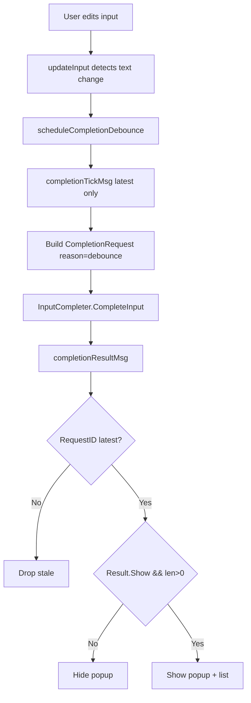
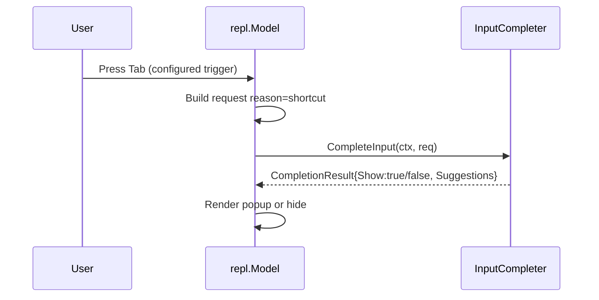

# Autocomplete Implementation Guide

## Executive Summary

This guide defines how to implement autocomplete in `bobatea/pkg/repl` without putting trigger-detection logic in the REPL itself. The REPL will only do two things:

- schedule debounced completion requests after input edits,
- trigger explicit requests from keyboard shortcuts (for example `Tab`) when configured.

The input completer owns all trigger decisions, including whether a given request should produce suggestions.

> [!NOTE]
> Core constraint from the ticket: REPL must not parse input to decide if completion should trigger. That decision belongs to the completer.

The recommended implementation is incremental and low-risk:

- add a small completion request/response contract in `pkg/repl`,
- add REPL-local autocomplete state and message types,
- add debounced scheduling and stale-result suppression,
- add configurable explicit trigger keys (including optional `Tab` mode),
- render suggestions as a popup list near input,
- keep submit/history/timeline logic untouched.

## Problem Statement

`repl.Model` currently has no autocomplete integration. The existing standalone autocomplete widget in `bobatea/pkg/autocomplete/autocomplete.go` is not directly suitable for REPL integration because it currently:

- owns its own `textinput.Model` instead of consuming REPL input,
- auto-triggers completion when input text changes,
- performs internal sleep-based debounce in `completionCmd`.

In parallel, `repl.Model.updateInput` currently maps `"tab"` to focus switching between input and timeline. This conflicts with optional shortcut-triggered completion.

We need REPL autocomplete that is:

- evaluator/completer driven,
- debounce scheduled by REPL,
- explicit-trigger capable (`Tab` or other key),
- resilient to stale async responses,
- backwards-compatible when autocomplete is disabled.

## Fundamentals (Newcomer Context)

Autocomplete is an **input-side feature**. It should not disturb the existing transcript-side pipeline (`EvaluateStream` -> `repl.events` -> `timeline.*`).

Current architecture split:

- Input-side state and key handling: `bobatea/pkg/repl/model.go` (`updateInput`, `View`).
- Evaluation output pipeline: `submit`, `publishReplEvent`, `RegisterReplToTimelineTransformer`.
- Reusable candidate list primitive: `bobatea/pkg/listbox/listbox.go`.

> [!TIP]
> Treat autocomplete as a local UI subsystem inside `repl.Model`, not as a timeline event stream concern.

## Current Relevant Locations

Primary integration points:

- `bobatea/pkg/repl/model.go`
- `NewModel`: initialize completion state/model.
- `updateInput`: edit detection, debounce scheduling, explicit trigger key handling, selection apply.
- `Update`: handle async completion result messages.
- `View`: render popup/help text with input.

- `bobatea/pkg/repl/config.go`
- add `Autocomplete` config block and key bindings.

- `bobatea/pkg/repl/evaluator.go`
- add optional completer interface for evaluator-backed completion.

Supporting widgets:

- `bobatea/pkg/autocomplete/autocomplete.go`
- can be reused partially, but current trigger/debounce behavior should not be reused as-is.

- `bobatea/pkg/listbox/listbox.go`
- lightweight candidate list for popup rendering and navigation.

## Design Goals and Non-Goals

Goals:

- Debounce scheduling exists in REPL.
- Trigger decision is delegated to completer.
- Optional keyboard shortcut trigger exists (including `Tab` if configured).
- Async completion responses cannot overwrite newer input context.
- Minimal disruption to current REPL behavior.

Non-goals:

- No semantic trigger heuristics in REPL (for example dot-prefix rules).
- No deep refactor of evaluator streaming pipeline.
- No requirement to always use `pkg/autocomplete.Model` unchanged.

## Implementation Path Decision (Task 2)

Decision: proceed with a **fresh-cutover rewrite for REPL integration**, not a compatibility-preserving extension of the existing `pkg/autocomplete.Model`.

Concretely:

- REPL autocomplete behavior will be implemented in a new REPL-first path (state/messages/rendering/contracts in `pkg/repl`).
- Existing `pkg/autocomplete` can be reused selectively (types/list handling ideas) but is not an API compatibility constraint.
- No migration shims are required for this ticket; callers should move to the new REPL path directly.

Rationale:

- The old widget couples trigger and debounce policy to widget internals.
- This ticket requires trigger ownership in the input completer and debounce ownership in REPL.
- A clean cut avoids hidden behavior conflicts and enables faster iteration.

## Proposed Solution

### 1) Add an Optional Completer Contract in `pkg/repl`

Add new types (for example in `bobatea/pkg/repl/autocomplete_types.go`):

```go
type CompletionReason string

const (
    CompletionReasonDebounce CompletionReason = "debounce"
    CompletionReasonShortcut CompletionReason = "shortcut"
    CompletionReasonManual   CompletionReason = "manual"
)

type CompletionRequest struct {
    Input      string
    CursorByte int
    Reason     CompletionReason
    Shortcut   string // optional; e.g. "tab"
    RequestID  uint64 // monotonic from REPL
}

type CompletionResult struct {
    Suggestions []autocomplete.Suggestion
    ReplaceFrom int // byte offset inclusive
    ReplaceTo   int // byte offset exclusive
    Show        bool // false means completer decided "do not show"
}

type InputCompleter interface {
    CompleteInput(ctx context.Context, req CompletionRequest) (CompletionResult, error)
}
```

`Show=false` is the explicit mechanism that keeps trigger decision in the completer.

### 2) Add REPL Autocomplete State

Extend `repl.Model` with local state:

```go
autocompleteEnabled bool
completer           InputCompleter

completionReqSeq    uint64 // latest scheduled request id
completionActiveSeq uint64 // latest request sent
completionVisible   bool
completionItems     []autocomplete.Suggestion
completionSelected  int
completionReplaceFrom int
completionReplaceTo   int

completionDebounce time.Duration
```

Also add async message types:

```go
type completionTickMsg struct { RequestID uint64 }
type completionResultMsg struct {
    RequestID uint64
    Result    CompletionResult
    Err       error
}
```

### 3) Debounce Scheduling in `updateInput`

On any input mutation (detected by `prev != current`), REPL schedules debounce tick and does nothing else.

Important: REPL does not inspect syntax/words to decide whether completion should appear.

```go
func (m *Model) scheduleCompletionDebounce() tea.Cmd {
    m.completionReqSeq++
    reqID := m.completionReqSeq
    return tea.Tick(m.completionDebounce, func(time.Time) tea.Msg {
        return completionTickMsg{RequestID: reqID}
    })
}
```

When `completionTickMsg` fires:

- ignore if not latest `RequestID`,
- build `CompletionRequest{Reason: CompletionReasonDebounce}` from current input/cursor,
- call completer async and return `completionResultMsg`.

### 4) Explicit Shortcut Trigger (Optional `Tab`)

When configured key is pressed, REPL issues immediate completion request with:

- `Reason: CompletionReasonShortcut`,
- `Shortcut: "tab"` (or configured key).

No extra trigger detection logic is added in REPL.

### 5) Stale Response Protection

Each request carries `RequestID`. Result handling rule:

- if `msg.RequestID != m.completionReqSeq`, ignore message.

This prevents old async results from overriding newer typing state.

### 6) Suggestion Rendering and Apply

Render a popup list under/near input when `completionVisible` and suggestions exist. Keyboard behavior when popup visible:

- `up` / `down`: move selected suggestion,
- `enter` or `tab` (configurable): apply selected completion,
- `esc`: close popup.

Applying completion uses completer-provided replace range:

```go
newInput := input[:ReplaceFrom] + selected.Value + input[ReplaceTo:]
```

Then set cursor after inserted value and close popup.

## Key Routing Design (Including `Tab`)

Current behavior conflict:

- `model.go:updateInput` maps `tab` to focus switch to timeline.

If `Tab` is used as completion trigger, focus switching must move to a different key to avoid ambiguity.

Recommended key strategy:

- Default mode (safe/backward-ish):
- `ctrl+t` toggles input/timeline focus.
- `tab` can be assigned to completion trigger when popup/integration enabled.

- Compatibility mode:
- keep existing `tab` focus-switch when autocomplete is disabled.
- when autocomplete enabled and `tab` is trigger, focus-switch is moved to `ctrl+t`.

> [!WARNING]
> Terminal handling of `ctrl+tab` is inconsistent. Avoid depending on it for core navigation.

Suggested config additions (`bobatea/pkg/repl/config.go`):

```go
type AutocompleteConfig struct {
    Enabled             bool
    Debounce            time.Duration
    RequestTimeout      time.Duration
    TriggerKeys         []string // e.g. []{"tab"}, []{"ctrl+space"}
    AcceptKeys          []string // e.g. []{"enter", "tab"}
    FocusToggleKey      string   // e.g. "ctrl+t"
    MaxSuggestions      int
    OverlayMaxWidth     int
    OverlayMaxHeight    int
    OverlayMinWidth     int
    OverlayMargin       int
    OverlayPageSize     int
    OverlayOffsetX      int
    OverlayOffsetY      int
    OverlayNoBorder     bool
    OverlayPlacement    CompletionOverlayPlacement      // auto|above|below|bottom
    OverlayHorizontalGrow CompletionOverlayHorizontalGrow // right|left
}
```

The latest overlay tuning additions (`OverlayPlacement`, `OverlayHorizontalGrow`) let operators choose whether the popup prefers auto above/below behavior, is pinned low (`bottom`), or grows left from the cursor anchor for tighter layouts.

## Idiomatic Bobatea Integration (Implemented)

To align REPL behavior with existing bobatea conventions, the implementation now follows the same interaction pattern used by chat:

- Key routing now uses `key.Binding` and `key.Matches` (no ad-hoc string switch tables for primary actions).
- REPL has a dedicated `pkg/repl/keymap.go` with `ShortHelp()` / `FullHelp()` and mode tags.
- `mode-keymap.EnableMode` is used to toggle available bindings between `input` and `timeline`.
- `bubbles/help.Model` is embedded in REPL and rendered in `View()` for dynamic, mode-aware key help.
- View composition uses `lipgloss.JoinVertical(...)` sections (`title`, `timeline`, `input`, `completion popup`, `help`) instead of manual string concatenation.

This keeps REPL interaction semantics consistent with the rest of bobatea and gives us a single keymap source of truth for behavior + help output.

## Message Flow Diagram



Explicit shortcut path:



## Alternatives Considered

### Alternative A: Reuse `pkg/autocomplete.Model` unchanged

Pros:

- less new code,
- existing selection model and messages.

Cons:

- owns independent `textinput`,
- hard-coded update-trigger semantics,
- debounce sleep in widget, not REPL,
- violates new trigger ownership boundary.

Status: not recommended as-is.

### Alternative B: Refactor `pkg/autocomplete` into headless controller + UI list (Recommended)

Pros:

- reusable across REPL/chat,
- clean separation: scheduling in REPL, policy in completer,
- easier to unit test request sequencing.

Cons:

- moderate refactor effort,
- touches package API.

Status: recommended if reuse is a priority.

### Alternative C: Implement REPL-local autocomplete subsystem only

Pros:

- fastest delivery,
- minimal cross-package churn.

Cons:

- possible duplication with `pkg/autocomplete`,
- harder future convergence.

Status: acceptable for first milestone if schedule-constrained.

## Detailed Implementation Plan

### Phase 1: Contracts and Config

- Add new file `bobatea/pkg/repl/autocomplete_types.go`.
- Add optional interface(s) in `bobatea/pkg/repl/evaluator.go` or sibling file.
- Extend `bobatea/pkg/repl/config.go` with `AutocompleteConfig` and defaults.
- Keep `DefaultConfig()` backward-compatible (`Enabled=false` by default).

### Phase 2: Model State + Messages

- Extend `repl.Model` fields in `bobatea/pkg/repl/model.go`.
- Add completion message structs near existing internal messages.
- Initialize completion state in `NewModel`.

### Phase 3: Input Update Integration

- In `updateInput`:
- keep existing submit/history behavior.
- add input mutation detection and debounce scheduling.
- add explicit shortcut trigger command path.
- add popup-navigation handling when visible.

- In top-level `Update`:
- handle `completionTickMsg`.
- dispatch async complete command.
- handle `completionResultMsg` with stale filtering.

### Phase 4: Rendering

- Add helper methods in `model.go` (or `autocomplete_view.go`):
- `renderAutocompletePopup()`
- `applySelectedSuggestion()`

- Compose popup with current REPL view.
- Keep timeline view unchanged.

### Phase 5: Keymap Cleanup

- Introduce explicit focus-toggle key (`ctrl+t` recommended).
- Gate old `tab` focus-switch behavior behind config compatibility flag.
- Document key behavior in help text string in `View()`.

### Phase 6: Tests

Add tests in `bobatea/pkg/repl/repl_test.go` (or dedicated `autocomplete_test.go`):

- Debounce scheduling:
- multiple rapid edits produce only latest active request.

- Stale result drop:
- out-of-order results do not overwrite newer request state.

- Shortcut trigger:
- pressing configured key sends request with `Reason=shortcut`.

- Apply suggestion:
- replace range and cursor position are correct.

- Key conflict behavior:
- `tab` semantics differ correctly based on config.

## Pseudocode for Critical Paths

### Debounce + Request Dispatch

```go
func (m *Model) onInputEdited() tea.Cmd {
    if !m.autocompleteEnabled || m.completer == nil {
        return nil
    }
    m.completionReqSeq++
    reqID := m.completionReqSeq
    return tea.Tick(m.config.Autocomplete.Debounce, func(time.Time) tea.Msg {
        return completionTickMsg{RequestID: reqID}
    })
}

func (m *Model) handleCompletionTick(msg completionTickMsg) tea.Cmd {
    if msg.RequestID != m.completionReqSeq {
        return nil
    }
    req := m.buildCompletionRequest(msg.RequestID, CompletionReasonDebounce, "")
    return m.completionCmd(req)
}

func (m *Model) completionCmd(req CompletionRequest) tea.Cmd {
    return func() tea.Msg {
        ctx, cancel := context.WithTimeout(context.Background(), m.config.Autocomplete.RequestTimeout)
        defer cancel()
        res, err := m.completer.CompleteInput(ctx, req)
        return completionResultMsg{RequestID: req.RequestID, Result: res, Err: err}
    }
}
```

### Shortcut Handling

```go
func (m *Model) maybeTriggerShortcut(key string) tea.Cmd {
    if !contains(m.config.Autocomplete.TriggerKeys, key) {
        return nil
    }
    m.completionReqSeq++
    req := m.buildCompletionRequest(m.completionReqSeq, CompletionReasonShortcut, key)
    return m.completionCmd(req)
}
```

### Result Apply

```go
func (m *Model) handleCompletionResult(msg completionResultMsg) {
    if msg.RequestID != m.completionReqSeq {
        return // stale
    }
    if msg.Err != nil || !msg.Result.Show || len(msg.Result.Suggestions) == 0 {
        m.hideCompletion()
        return
    }
    m.completionItems = limit(msg.Result.Suggestions, m.config.Autocomplete.MaxSuggestions)
    m.completionReplaceFrom = msg.Result.ReplaceFrom
    m.completionReplaceTo = msg.Result.ReplaceTo
    m.completionVisible = true
    m.completionSelected = 0
}
```

## Refactor Notes for `pkg/autocomplete`

If you choose Alternative B (recommended for reuse), refactor `bobatea/pkg/autocomplete/autocomplete.go`:

- Remove internal sleep-based debounce from completion command.
- Move trigger-on-input-change logic behind an option.
- Allow external driving mode where caller supplies query + cursor and asks for completion explicitly.

Possible API shape:

```go
type TriggerMode int
const (
    TriggerInternal TriggerMode = iota
    TriggerExternal
)

type Options struct {
    TriggerMode TriggerMode
    Debounce    time.Duration // only used when TriggerInternal
}
```

This keeps old usage possible while enabling REPL-driven scheduling.

## Risks and Mitigations

Risk: Tab key ambiguity with focus-switch.

- Mitigation: configurable focus key, default `ctrl+t` when tab-trigger is enabled.

Risk: Async races causing flicker.

- Mitigation: request IDs + stale drop rule.

Risk: completer latency causes sluggish UX.

- Mitigation: strict `RequestTimeout`, optional "loading" indicator, fast cancelable contexts.

Risk: duplicate logic between REPL and `pkg/autocomplete`.

- Mitigation: choose one of two clear strategies (headless refactor or REPL-local first then extract).

## Acceptance Criteria

- REPL schedules debounced completion after edits.
- REPL does not implement syntax/token trigger detection.
- Completer receives `CompletionRequest` with reason and may return `Show=false`.
- Shortcut-triggered completion works for configured keys (including optional `tab`).
- Stale completion responses are ignored.
- Existing submit/history/timeline behavior remains intact when autocomplete is enabled.
- No behavior change when autocomplete is disabled.

## Implementation Checklist

- [ ] Add completion contracts and request/result types.
- [ ] Add autocomplete config with defaults.
- [ ] Wire optional completer discovery in `NewModel`.
- [ ] Add debounce scheduling state and messages.
- [ ] Add completion result handling and stale filtering.
- [ ] Add popup view and selection apply.
- [ ] Add configurable shortcut trigger handling.
- [ ] Resolve `tab`/focus conflict with explicit focus-toggle key.
- [ ] Add/update tests for debounce, stale results, and key routing.
- [ ] Update help text and docs for key behavior.

## References

- `bobatea/pkg/repl/model.go`
- `bobatea/pkg/repl/config.go`
- `bobatea/pkg/repl/evaluator.go`
- `bobatea/pkg/autocomplete/autocomplete.go`
- `bobatea/pkg/listbox/listbox.go`
- `bobatea/pkg/repl/repl_test.go`
- `bobatea/ttmp/2026/02/13/BOBA-001-IMPROVE-REPL-ANALYSIS--improve-repl-analysis/analysis/01-repl-integration-analysis.md`
