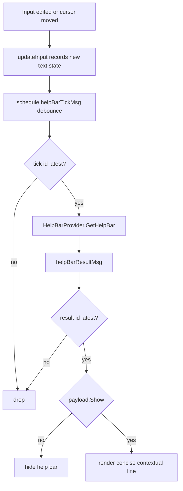

# Help Bar Analysis and Implementation Guide

## Executive Summary

This document proposes a contextual help bar for `bobatea/pkg/repl` that updates while the user types, similar to autocomplete cadence, but with separate rendering and behavior goals.

The help bar should:

- refresh on input edits through debounced scheduling,
- delegate semantic decisions to evaluator/completer-side providers,
- display concise context (symbol/type/signature/module hints),
- stay stable under asynchronous updates and slow providers.

> [!NOTE]
> Trigger policy remains provider-owned. The REPL schedules update opportunities; providers decide whether to show data.

## BOBA-002 Learnings Applied

The autocomplete implementation (BOBA-002) introduced patterns we should reuse directly for help bar work:

- **Request ID stale-drop is mandatory** for async UI safety.
- **Debounce scheduling should not eagerly hide visible UI** (prevents flicker under continuous typing).
- **Config normalization guards invalid values and keeps defaults stable**.
- **`key.Binding` and `help.Model` remain source-of-truth for key help output**.
- **View composition should keep dynamic contextual rows explicit** so overlays and bars do not fight for layout ownership.

Implementation decisions for BOBA-003 therefore follow the same structure used successfully in `pkg/repl/model.go` for completion:

- dedicated message types,
- dedicated request sequence counter,
- stale response drop by `RequestID`,
- timeout-bounded provider calls with panic-safe command wrapper.

## Problem Statement

The current REPL in `bobatea/pkg/repl/model.go` renders:

- title,
- timeline transcript,
- input line,
- static one-line keyboard help.

There is no live, typed-symbol feedback. Users cannot see type/signature context for the token at cursor position while typing.

Without a help bar:

- discoverability of evaluator APIs is poor,
- users rely on trial-and-error and runtime failures,
- high-frequency edit loops feel blind.

## Existing Architecture Context

Relevant surfaces:

- `bobatea/pkg/repl/model.go`
- input key handling and render composition.

- `bobatea/pkg/repl/config.go`
- natural place for help-bar feature flags and debounce tuning.

- `bobatea/pkg/repl/evaluator.go`
- current narrow evaluator interface; requires optional capability extension.

- `bobatea/pkg/autocomplete/autocomplete.go`
- existing completion UI model; currently not directly embedded in `repl.Model`.

> [!TIP]
> The help bar should not depend on the legacy autocomplete widget internals. This keeps room for replacing autocomplete with a new engine.

## UX Contract for Help Bar

### User-visible behavior

- As typing/cursor changes settle, help bar updates.
- If context is unknown or ambiguous, bar can hide or show neutral text.
- Update latency target: perceived near-real-time (typically <200ms after typing pause).

### Content scope

Single-line concise output, for example:

- function signature: `map(arr: []T, fn: (T) -> U) -> []U`
- inferred type: `obj.user.email: string`
- module hint: `require("database") exports: query, exec, transaction`

### Non-goals

- full documentation rendering (belongs to help drawer ticket),
- multi-line code examples in this bar,
- heavy parser diagnostics stream.

## Proposed Provider Contract

Introduce optional REPL capability interface (separate file recommended, e.g. `bobatea/pkg/repl/help_bar_types.go`):

```go
type HelpBarReason string

const (
    HelpBarReasonDebounce HelpBarReason = "debounce"
    HelpBarReasonShortcut HelpBarReason = "shortcut"
    HelpBarReasonManual   HelpBarReason = "manual"
)

type HelpBarRequest struct {
    Input      string
    CursorByte int
    RequestID  uint64
    Reason     HelpBarReason
}

type HelpBarPayload struct {
    Show      bool
    Text      string
    Kind      string // signature|type|module|error|info
    Severity  string // info|warning|error
    Ephemeral bool
}

type HelpBarProvider interface {
    GetHelpBar(ctx context.Context, req HelpBarRequest) (HelpBarPayload, error)
}
```

Provider-owned decisions:

- whether bar should be shown (`Show`),
- what content appears,
- semantic classification (`Kind`).

## Integration Strategy in `repl.Model`

Add local state:

```go
helpBarProvider   HelpBarProvider
helpBarVisible    bool
helpBarPayload    HelpBarPayload
helpBarReqSeq     uint64
helpBarDebounce   time.Duration
helpBarTimeout    time.Duration
helpBarLastErr    error
```

Add messages:

```go
type helpBarTickMsg struct{ RequestID uint64 }
type helpBarResultMsg struct {
    RequestID uint64
    Payload   HelpBarPayload
    Err       error
}
```

### Scheduling rule

On input mutation:

- increment `helpBarReqSeq`,
- schedule `helpBarTickMsg` after debounce,
- on tick, drop stale IDs and request provider asynchronously.

> [!IMPORTANT]
> Match BOBA-002 stability behavior: do not clear a currently visible help bar merely because a new debounced request was scheduled. Clear only on explicit result policy (`Show=false`, empty payload, or errors depending on config policy).

### Stale-drop rule

If `msg.RequestID != helpBarReqSeq`, ignore.

This matches safe async patterns proposed for autocomplete.

## Dataflow Diagram



## Rendering Design

Current `View()` order in `model.go` is transcript -> input -> static help line.

Recommended layout:

1. timeline view
2. input
3. help bar (dynamic)
4. static key help

Rendering helper:

```go
func (m *Model) renderHelpBar() string {
    if !m.helpBarVisible {
        return ""
    }
    style := m.styles.Info
    switch m.helpBarPayload.Severity {
    case "warning":
        style = m.styles.HelpText
    case "error":
        style = m.styles.Error
    }
    return style.Render(m.helpBarPayload.Text)
}
```

## Key Design Decisions

### Decision 1: Keep help bar separate from autocomplete list

Rationale:

- different purpose and density,
- bar should still work if suggestion popup is hidden,
- supports replacing autocomplete widget later.

### Decision 2: Reuse scheduling pattern but keep independent provider interface

Rationale:

- shared mental model for stale handling,
- independent iteration speed and testing.
- easier side-by-side operation with autocomplete without tight coupling.

### Decision 3: Provider decides whether context is display-worthy

Rationale:

- keeps REPL policy-simple,
- language-specific heuristics live near evaluator/parser.

## Alternatives Considered

### A) Help bar derived from selected autocomplete item only

Pros:

- easy if list already exists,
- no new provider.

Cons:

- no help without visible completion list,
- cannot show context when no candidate list is relevant.

Status: rejected.

### B) Render help bar as timeline entity

Pros:

- reuses timeline renderers.

Cons:

- semantically wrong (help bar is transient input state, not transcript event),
- pollutes transcript history.

Status: rejected.

### C) Single unified `InputContextProvider` for autocomplete+help bar+drawer

Pros:

- one parser call per debounce cycle,
- shared cursor context and cache,
- cleaner cross-feature consistency.

Cons:

- larger initial refactor.

Status: recommended medium-term architecture.

## Implementation Plan

### Phase 1: Contracts and Config

- Add `HelpBarProvider` types and request/result structs.
- Extend `Config` with:

```go
type HelpBarConfig struct {
    Enabled bool
    Debounce time.Duration
    RequestTimeout time.Duration
}
```

### Phase 2: Model Wiring

- Add help bar state and async messages in `model.go`.
- Discover optional provider via type assertion in `NewModel`.

### Phase 3: Input-driven Scheduling

- Detect text/cursor changes in `updateInput`.
- Schedule debounce tick.
- Dispatch provider call on latest tick only.

### Phase 4: Rendering and Styling

- Add `renderHelpBar()` helper.
- Map `help bar severity` to existing style tokens (`Info`, `HelpText`, `Error`) to avoid style surface growth.

### Phase 5: Tests

Add `repl` tests for:

- debounce coalescing,
- stale response drop,
- hide/show behavior based on `Show` flag,
- view composition order.

## Pseudocode

```go
func (m *Model) onInputChanged() tea.Cmd {
    if !m.config.HelpBar.Enabled || m.helpBarProvider == nil {
        m.helpBarVisible = false
        return nil
    }
    m.helpBarReqSeq++
    id := m.helpBarReqSeq
    return tea.Tick(m.config.HelpBar.Debounce, func(time.Time) tea.Msg {
        return helpBarTickMsg{RequestID: id}
    })
}

func (m *Model) handleHelpBarTick(msg helpBarTickMsg) tea.Cmd {
    if msg.RequestID != m.helpBarReqSeq {
        return nil
    }
    req := HelpBarRequest{
        Input: m.textInput.Value(),
        CursorByte: m.textInput.Position(),
        RequestID: msg.RequestID,
        Reason: HelpBarReasonDebounce,
    }
    return func() tea.Msg {
        ctx, cancel := context.WithTimeout(context.Background(), m.config.HelpBar.RequestTimeout)
        defer cancel()
        payload, err := m.helpBarProvider.GetHelpBar(ctx, req)
        return helpBarResultMsg{RequestID: msg.RequestID, Payload: payload, Err: err}
    }
}
```

## Performance and Reliability Considerations

- Keep request timeouts short (200-500ms typical).
- Use request IDs to avoid stale flicker.
- Optional lightweight cache in provider keyed by `(input,cursor)`.
- Avoid expensive markdown rendering in help bar path.

## Interop with Autocomplete Replacement

> [!IMPORTANT]
> This design intentionally does not depend on `pkg/autocomplete.Model` internals.

If autocomplete is replaced (or rewritten headless), help bar still works because it only depends on:

- input snapshot,
- cursor position,
- provider result contract.

Recommended future direction:

- `InputContextProvider` returning bundle:
  - completion candidates,
  - help bar payload,
  - help drawer payload seed.

## Risks and Mitigations

Risk: noisy frequent updates while cursor moves.

- Mitigation: debounce + same-request dedupe.

Risk: provider latency degrades typing feel.

- Mitigation: async non-blocking requests, timeout, stale drop.

Risk: inconsistent semantics across languages.

- Mitigation: per-evaluator providers behind shared contract.

## Acceptance Criteria

- Help bar updates from typing cadence (debounced).
- REPL has no symbol-trigger heuristics for bar display.
- Provider can suppress display with `Show=false`.
- Stale async responses are ignored.
- Feature is safe when autocomplete widget is replaced or rewritten.

## Implementation Status (2026-02-13)

This design is now implemented in BOBA-003 code commit `76feb91`.

- Added contracts in `pkg/repl/help_bar_types.go`:
  - `HelpBarProvider`
  - `HelpBarRequest` (includes `reason`, `request_id`, `cursor`, `shortcut`)
  - `HelpBarPayload`
- Added config in `pkg/repl/config.go`:
  - `HelpBarConfig`
  - `DefaultHelpBarConfig()`
  - `Config.HelpBar`
- Integrated model scheduling and async flow in `pkg/repl/model.go`:
  - provider discovery in `NewModel`
  - debounce tick/result messages
  - stale-drop by `RequestID`
  - timeout-bounded provider call with panic recovery
  - no-flicker behavior while debounce is pending
  - rendering between input line and static key help
  - severity mapping (`error -> Error`, `warning -> HelpText`, default `Info`)
- Added coverage in `pkg/repl/help_bar_model_test.go` and `pkg/repl/repl_test.go`:
  - debounce coalescing
  - stale result drop
  - hide/show policy
  - timeout and panic handling
  - typing-flow integration
  - no-provider inert behavior
- Validation:
  - `go test ./pkg/repl/... -count=1`
  - `golangci-lint run -v --max-same-issues=100`

> [!NOTE]
> To keep root lint/test runs from typechecking ticket scripts under `ttmp/`, a nested module marker was added at `ttmp/go.mod`.

## Checklist

- [x] Add provider interface/types.
- [x] Add `HelpBarConfig` defaults.
- [x] Wire model state and messages.
- [x] Implement scheduling and async handling.
- [x] Implement dynamic render line and styles.
- [x] Add tests for debounce/stale/view behavior.

## References

- `bobatea/pkg/repl/model.go`
- `bobatea/pkg/repl/config.go`
- `bobatea/pkg/repl/evaluator.go`
- `bobatea/pkg/repl/styles.go`
- `bobatea/pkg/autocomplete/autocomplete.go`
- `bobatea/ttmp/2026/02/13/BOBA-002-AUTOCOMPLETE-REPL-IMPLEMENTATION--repl-autocomplete-implementation/design-doc/01-autocomplete-implementation-guide.md`
