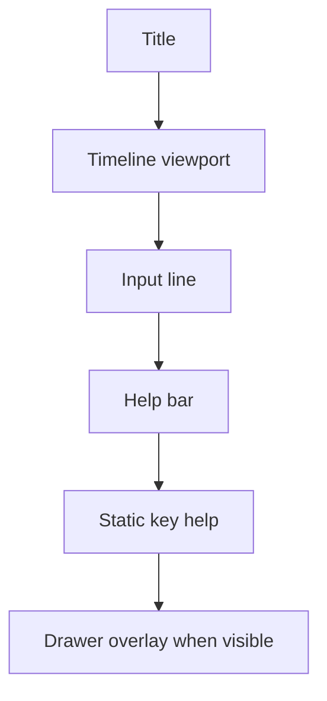
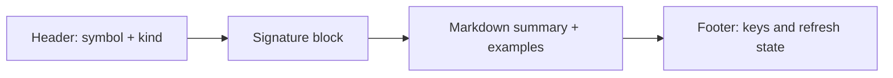

# Help Drawer Analysis and Implementation Guide

## Executive Summary

This guide defines a REPL help drawer that opens via keyboard shortcut and shows richer contextual documentation than the one-line help bar. While open, it should continue adapting to current input as the user types.

Core behavior:

- open/close by shortcut (`ctrl+h` default recommended),
- request contextual help based on current input/cursor,
- keep updating while visible as typing changes,
- remain non-blocking and robust against stale async responses.

> [!NOTE]
> The drawer is an input-side transient UI, not transcript content. It should not be published as timeline entities.

## Problem Statement

Current REPL has no expandable context documentation surface. Users can submit code and inspect transcript output, but cannot easily inspect full function/module docs before executing.

A help drawer addresses this by providing:

- signature details,
- extended markdown help,
- examples and notes,
- related symbols or overloads.

Without it, users overuse trial execution and external docs.

## Current State and Constraints

Relevant files:

- `bobatea/pkg/repl/model.go`
- key routing and view composition, current focus switching (`tab`) behavior.

- `bobatea/pkg/repl/config.go`
- currently minimal; needs drawer config.

- `bobatea/pkg/repl/evaluator.go`
- needs optional help-provider capability discovery.

- `bobatea/pkg/overlay/overlay.go`
- existing overlay utility (legacy approach).

- lipgloss v2 context in prior analysis (`BOBA-001` addendum)
- canvas layers provide cleaner long-term rendering for overlays/drawers.

## UX Contract

### Trigger and visibility

- `ctrl+h` toggles drawer open/closed.
- optional alias: `f1` when terminal supports it.
- when closed, no drawer update requests are sent unless prefetch enabled.

### Adaptive updates

- when open, input edits schedule debounced refresh requests,
- cursor movement can also refresh context,
- stale responses are ignored.

### Content layout

Suggested sections:

- header: symbol/module + kind,
- signature/type block,
- summary paragraph,
- examples (compact),
- navigation hint footer.

## Provider Contract

Recommended new types in `bobatea/pkg/repl/help_drawer_types.go`:

```go
type HelpDrawerRequest struct {
    Input      string
    CursorByte int
    RequestID  uint64
    Trigger    string // toggle-open|typing|manual-refresh
}

type HelpDrawerDocument struct {
    Show        bool
    Title       string
    Subtitle    string
    Markdown    string
    Diagnostics []string
    VersionTag  string
}

type HelpDrawerProvider interface {
    GetHelpDrawer(ctx context.Context, req HelpDrawerRequest) (HelpDrawerDocument, error)
}
```

Provider controls:

- whether drawer has content to show,
- markdown/structured text rendering payload,
- versioning marker (`VersionTag`) for cache diagnostics.

## REPL Model Integration

### State additions

```go
helpDrawerProvider HelpDrawerProvider
helpDrawerVisible  bool
helpDrawerDoc      HelpDrawerDocument
helpDrawerReqSeq   uint64
helpDrawerDebounce time.Duration
helpDrawerTimeout  time.Duration
helpDrawerLoading  bool
helpDrawerErr      error
```

### Messages

```go
type helpDrawerTickMsg struct{ RequestID uint64 }
type helpDrawerResultMsg struct {
    RequestID uint64
    Doc       HelpDrawerDocument
    Err       error
}
```

### Input/update behavior

- shortcut toggle opens/closes drawer,
- open action can fire immediate request (`Trigger: "toggle-open"`),
- while visible, typing schedules debounced update (`Trigger: "typing"`).

## View Composition and Rendering

### Option A: Overlay utility (low-risk now)

- Base REPL view unchanged.
- Drawer rendered as panel string and placed with `overlay.PlaceOverlay`.

Pros:

- minimal new dependency behavior,
- immediate compatibility.

Cons:

- complex with resize and background clipping,
- less explicit layering semantics.

### Option B: Lipgloss v2 canvas layer integration (recommended medium-term)

- input + timeline in base layer,
- drawer in dedicated top layer,
- predictable z-order and redraw.

Pros:

- cleaner mental model for popups/drawers/palette coexistence,
- easier to add animations and transitions.

Cons:

- requires broader rendering abstraction updates.

> [!TIP]
> Start with Option A for delivery speed, keep rendering adapter seam so migration to canvas layers is straightforward.

## Layout Diagram



Drawer internals:



## Key Handling Matrix

When drawer hidden:

- `ctrl+h`: open drawer,
- normal input/edit keys: unchanged.

When drawer visible:

- `ctrl+h` or `esc`: close drawer,
- `ctrl+r`: manual drawer refresh,
- optional scroll keys inside drawer (`pgup/pgdown`, `up/down`) when focus mode is drawer.

Focus model options:

- shared input focus (recommended v1): typing still edits input while drawer updates,
- explicit drawer focus (optional v2): navigation keys scroll docs without affecting input.

## Design Decisions

### Decision 1: Keyboard-toggle, not auto-pop full drawer

Rationale:

- avoids visual overload,
- preserves fast typing flow,
- pairs naturally with concise always-on help bar.

### Decision 2: Live adaptive updates while open

Rationale:

- drawer remains relevant to current symbol,
- avoids stale docs after cursor moves.

### Decision 3: Async with stale ID filtering

Rationale:

- prevents race-induced content jumps,
- keeps UI responsive under parser latency.

## Alternatives Considered

### A) Static drawer content loaded only on open

Pros:

- simple behavior.

Cons:

- goes stale immediately during typing,
- contradicts requirement to adapt.

Status: rejected.

### B) Render drawer as a timeline side entity

Pros:

- reuses timeline visuals.

Cons:

- wrong persistence semantics,
- transcript pollution.

Status: rejected.

### C) Merge help drawer and command palette into one panel

Pros:

- fewer overlays.

Cons:

- conflates two very different tasks (discover commands vs read docs).

Status: rejected.

## Implementation Plan

### Phase 1: Contracts and Config

Add config block:

```go
type HelpDrawerConfig struct {
    Enabled           bool
    ToggleKeys        []string // default: ["ctrl+h"]
    CloseKeys         []string // default: ["esc", "ctrl+h"]
    Debounce          time.Duration
    RequestTimeout    time.Duration
    WidthPercent      int
    HeightPercent     int
    PrefetchWhenHidden bool
}
```

### Phase 2: Model State and Messages

- add provider/state fields,
- implement toggle + immediate request path,
- add periodic/adaptive update path while visible.

### Phase 3: Rendering

- implement drawer panel renderer,
- integrate with `overlay.PlaceOverlay` first,
- include loading and error states.

### Phase 4: Input Interaction

- keep input typing active while drawer visible,
- optionally add drawer-scroll submode behind config flag.

### Phase 5: Tests

Add tests for:

- toggle behavior,
- adaptive updates on typing while visible,
- stale drop race handling,
- close key handling,
- render fallback when provider returns `Show=false`.

## Pseudocode

```go
func (m *Model) toggleHelpDrawer() tea.Cmd {
    m.helpDrawerVisible = !m.helpDrawerVisible
    if !m.helpDrawerVisible {
        m.helpDrawerLoading = false
        return nil
    }
    m.helpDrawerReqSeq++
    req := m.newHelpDrawerRequest(m.helpDrawerReqSeq, "toggle-open")
    return m.helpDrawerCmd(req)
}

func (m *Model) onInputChanged() tea.Cmd {
    if !m.helpDrawerVisible || m.helpDrawerProvider == nil {
        return nil
    }
    m.helpDrawerReqSeq++
    id := m.helpDrawerReqSeq
    return tea.Tick(m.config.HelpDrawer.Debounce, func(time.Time) tea.Msg {
        return helpDrawerTickMsg{RequestID: id}
    })
}
```

## Performance Strategy

- Debounce updates while typing.
- Keep markdown rendering lightweight and truncated if needed.
- Optional provider cache by `(input,cursor)` or semantic node id.
- Set strict timeout and show stale-but-reasonable prior doc until new result arrives.

## Interop with Autocomplete Replacement

> [!IMPORTANT]
> Replacing `pkg/autocomplete` is fully compatible with this drawer design.

The drawer depends on an independent provider contract and input snapshot, not on any existing autocomplete widget internals.

Recommended long-term approach:

- build a shared `InputContextEngine` used by autocomplete/help bar/help drawer,
- each UI surface consumes only its own projection of context data.

## Risks and Mitigations

Risk: overlay collisions with future command palette.

- Mitigation: central `OverlayManager` with z-order (`palette > drawer > autocomplete`).

Risk: heavy markdown rendering slows frame rate.

- Mitigation: pre-render cache + line clamp in drawer view.

Risk: keybinding conflicts with timeline/input modes.

- Mitigation: explicit keymap table and config validation.

## Acceptance Criteria

- Drawer toggles with keyboard shortcut.
- While open, typing updates drawer context via debounce.
- Stale async responses do not overwrite fresh content.
- Drawer can be closed quickly without side effects.
- Behavior remains valid even if autocomplete widget is replaced.

## Checklist

- [ ] Add `HelpDrawerProvider` contracts.
- [ ] Add drawer config defaults and keymap.
- [ ] Add drawer state/messages in `repl.Model`.
- [ ] Implement toggle and adaptive refresh.
- [ ] Implement overlay render and loading/error states.
- [ ] Add tests for toggle/adaptive/stale behavior.

## References

- `bobatea/pkg/repl/model.go`
- `bobatea/pkg/repl/config.go`
- `bobatea/pkg/repl/evaluator.go`
- `bobatea/pkg/overlay/overlay.go`
- `bobatea/pkg/autocomplete/autocomplete.go`
- `bobatea/ttmp/2026/02/13/BOBA-001-IMPROVE-REPL-ANALYSIS--improve-repl-analysis/analysis/02-lipgloss-v2-canvas-layer-addendum.md`
