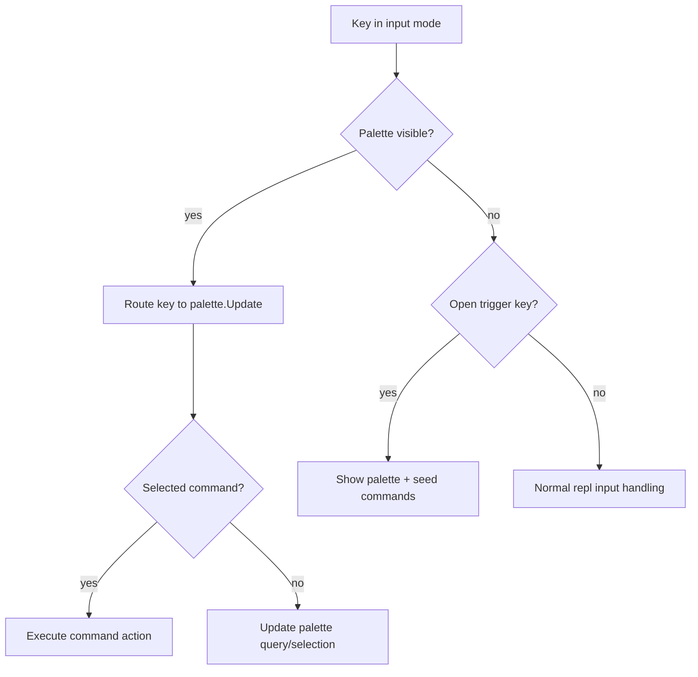
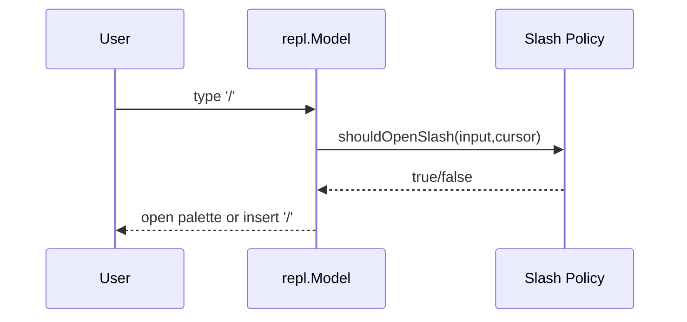

# Command Palette Analysis and Implementation Guide

## Executive Summary

This document defines how to integrate a command palette into `pkg/repl` with two entry paths:

- keyboard shortcut (`ctrl+p` recommended default),
- slash-driven entry (`/`) when enabled.

The palette should provide fuzzy command discovery, quick execution, and clean coexistence with input editing, autocomplete, help bar, and help drawer.

Post BOBA-008, the REPL is split across orchestration and feature files. Command palette integration should follow the same shape:

- root orchestration in `pkg/repl/model.go`,
- input routing in `pkg/repl/model_input.go`,
- config/defaults in `pkg/repl/config.go` and `pkg/repl/config_normalize.go`,
- dedicated command-palette feature files in `pkg/repl`.

> [!NOTE]
> It is acceptable to replace or rewrite current `pkg/autocomplete` or `pkg/commandpalette` internals as long as REPL contracts remain stable.

## Problem Statement

`repl/messages.go` contains `SlashCommandMsg`, but current `repl.Model` does not expose a full palette workflow. Users lack a discoverable command hub for actions like:

- clear input/history,
- toggle focus modes,
- open help surfaces,
- evaluator-specific utility commands.

Missing palette integration increases hidden functionality and inconsistent command invocation paths.

## Existing Components and Gaps

### Existing component

- `pkg/commandpalette/model.go`
- includes command registration, visibility, query filtering, selection, execution.

### Gaps for REPL use

- no direct integration in `repl.Model`,
- no action catalog abstraction for REPL + evaluator commands,
- no robust slash-entry policy in input mode,
- no central overlay z-order policy with future help drawer/autocomplete.

## BOBA-008 Architecture Alignment

Command palette should be integrated as a first-class feature model, not bolted into root state.

Target file ownership:

- `pkg/repl/command_palette_types.go`:
  - `CommandPaletteConfig`, slash policy enum, command descriptor/provider contracts.
- `pkg/repl/command_palette_model.go`:
  - palette state, built-in command registry, open/close/dispatch helpers.
- `pkg/repl/command_palette_overlay.go`:
  - palette overlay geometry + rendering for lipgloss v2 canvas layers.
- `pkg/repl/model_input.go`:
  - key routing precedence and slash-open guard rails.
- `pkg/repl/model.go`:
  - layer composition policy and update dispatch integration.

## UX and Behavior Contract

### Open triggers

- `ctrl+p`: open palette globally.
- `/`: optional open trigger policy, typically at empty input or command-mode prefix.

### While open

- arrow keys navigate,
- `enter` executes selected command,
- `esc` closes without side effects,
- typing filters commands fuzzily.

### Close conditions

- explicit close key,
- after command execution,
- on focus changes if configured.

## Slash Trigger Policy Options

### Policy A (recommended): open on `/` only when input is empty

Pros:

- avoids interfering with normal code typing (for regex/path/division syntax),
- predictable for users.

Cons:

- less aggressive discoverability.

### Policy B: open on `/` at column 0

Pros:

- supports command-line-like behavior.

Cons:

- still collides with valid code that starts with `/` in some languages.

### Policy C: delegate slash policy to completer/input-policy provider

Pros:

- language-aware decisions.

Cons:

- additional abstraction complexity.

Status: recommended medium-term; start with Policy A.

## Command Model Proposal

Define REPL command descriptor in dedicated palette types file:

```go
type PaletteCommand struct {
    ID          string
    Name        string
    Description string
    Category    string // repl|help|history|evaluator
    Keywords    []string
    Enabled     func(*Model) bool
    Action      func(*Model) tea.Cmd
}

type PaletteCommandProvider interface {
    ListPaletteCommands(ctx context.Context) ([]PaletteCommand, error)
}
```

Command sources:

- built-in REPL commands (clear, focus, toggle help bar/drawer, quit),
- evaluator-provided commands via optional provider capability,
- future plugin commands.

## Integration Architecture

### `repl.Model` additions

```go
palette commandPaletteModel
```

where internal feature state is owned by:

```go
type commandPaletteModel struct {
    ui            commandpalette.Model
    enabled       bool
    slashEnabled  bool
    slashPolicy   CommandPaletteSlashPolicy
    openKeys      []string
    closeKeys     []string
    maxVisible    int
    commands      []PaletteCommand
}

type CommandPaletteSlashPolicy string
const (
    CommandPaletteSlashPolicyEmptyInput CommandPaletteSlashPolicy = "empty-input"
    CommandPaletteSlashPolicyColumnZero CommandPaletteSlashPolicy = "column-zero"
    CommandPaletteSlashPolicyProvider   CommandPaletteSlashPolicy = "provider"
)
```

### update path

- If palette visible, route key events to palette first (before help drawer and completion navigation).
- If closed, check open triggers (`ctrl+p`, slash policy) before normal input editing.
- On selection, execute mapped action command.

### view path

- render base REPL view,
- overlay palette when visible as highest `lipgloss v2` layer.

## Message Flow Diagram



Slash path:



## Design Decisions

### Decision 1: Palette owns command search UX, REPL owns command semantics

Rationale:

- keeps commandpalette package generic,
- keeps REPL behavior local and testable.

### Decision 2: Build command registry abstraction now

Rationale:

- future evaluator/plugin commands need deterministic merge and dedupe,
- avoids hard-coded `RegisterCommand` scatter.

### Decision 3: Keep slash policy configurable and conservative by default

Rationale:

- avoids syntax collisions in language REPLs,
- still supports discoverability.

## Alternatives Considered

### A) Only slash commands, no palette UI

Pros:

- low implementation cost.

Cons:

- poor discoverability,
- no fuzzy find UX.

Status: rejected.

### B) Only `ctrl+p` palette, no slash behavior

Pros:

- minimal conflict risk.

Cons:

- misses command-line affordance and habit.

Status: acceptable fallback, not preferred primary target.

### C) Full rewrite of `pkg/commandpalette` before integration

Pros:

- cleaner future API possible.

Cons:

- delays feature delivery.

Status: not required for v1; incremental adaptation preferred.

## Implementation Plan

### Step 1: Config and Contracts

Extend `Config` with:

```go
type CommandPaletteConfig struct {
    Enabled           bool
    OpenKeys          []string // default: ["ctrl+p"]
    CloseKeys         []string // default: ["esc", "ctrl+p"]
    SlashOpenEnabled  bool
    SlashPolicy       CommandPaletteSlashPolicy
    MaxVisibleItems   int
}
```

Add command provider capability for evaluator-specific commands.

### Step 2: REPL Wiring

- Initialize palette feature state in `NewModel` using normalized config.
- Add command registry builder for built-ins + evaluator extensions.
- Add explicit key routing branch for visible palette.

### Step 3: Keyboard + Slash Entry

- Implement keyboard open/close with bobatea `key.Binding` integration.
- Implement conservative slash policy (`empty-input`) first.
- Ensure slash insertion still works when policy says no-open.

### Step 4: Overlay and Coexistence

- Render palette overlay above base view.
- Define z-order policy across overlays:
- `palette > completion popup > help drawer > base`.

### Step 5: Tests and Validation

Add tests for:

- open/close via keys,
- slash-open policy behavior,
- command execution dispatch,
- non-interference with standard input when palette hidden,
- overlay priority behavior.
- add focused validation gates:
  - `go test ./pkg/repl/... -count=1`
  - `golangci-lint run -v --max-same-issues=100 ./pkg/repl/...`

## Pseudocode

```go
func (m *Model) updateInput(k tea.KeyMsg) (tea.Model, tea.Cmd) {
    if handled, cmd := m.handleCommandPaletteInput(k); handled {
        return m, cmd
    }

    // existing precedence (help drawer shortcuts, completion nav, etc)
    ...
}

func (m *Model) handleCommandPaletteInput(k tea.KeyMsg) (bool, tea.Cmd) {
    if !m.palette.enabled {
        return false, nil
    }

    if m.palette.ui.IsVisible() {
        // route key to palette first
        var cmd tea.Cmd
        m.palette.ui, cmd = m.palette.ui.Update(k)
        return true, cmd
    }

    if key.Matches(k, m.keyMap.CommandPaletteOpen) {
        m.openCommandPalette()
        return true, nil
    }

    if k.String() == "/" && m.shouldOpenSlashPalette() {
        m.openCommandPalette()
        return true, nil // consume slash
    }
    return false, nil
}

func (m *Model) openCommandPalette() {
    m.rebuildCommandPalette()
    var cmd tea.Cmd
    _ = cmd
    m.palette.ui.Show()
}
```

## Interop with Autocomplete Replacement

Command palette integration should not depend on current autocomplete implementation details.

If autocomplete is replaced:

- palette key handling remains separate,
- slash policy still consults REPL/policy layer,
- command execution model remains unchanged.

Potential shared future component:

- unified input-intent router that arbitrates between autocomplete trigger, slash palette open, and help refresh scheduling.

## Risks and Mitigations

Risk: `/` collision with language syntax.

- Mitigation: conservative default policy + configurability.

Risk: key routing conflicts with timeline mode and help drawer.

- Mitigation: explicit precedence table and tests.

Risk: command action side effects during active async operations.

- Mitigation: action preconditions and safe cancellation hooks.

## Acceptance Criteria

- Palette can open via keyboard shortcut.
- Slash-driven open is configurable and works under selected policy.
- Palette commands are discoverable via fuzzy query and executable.
- REPL input behavior remains unchanged when palette is closed.
- Design remains compatible with replacing autocomplete widget.

## Checklist

- [ ] Add command palette config block.
- [ ] Add command descriptor/registry contracts.
- [ ] Wire palette model into REPL update/view loops.
- [ ] Implement keyboard open/close and command dispatch.
- [ ] Implement slash open policy and guard rails.
- [ ] Implement command actions and evaluator command extension hooks.
- [ ] Add tests for key routing, slash policy, and action dispatch.

## References

- `pkg/repl/model.go`
- `pkg/repl/model_input.go`
- `pkg/repl/config.go`
- `pkg/repl/config_normalize.go`
- `pkg/repl/keymap.go`
- `pkg/commandpalette/model.go`
